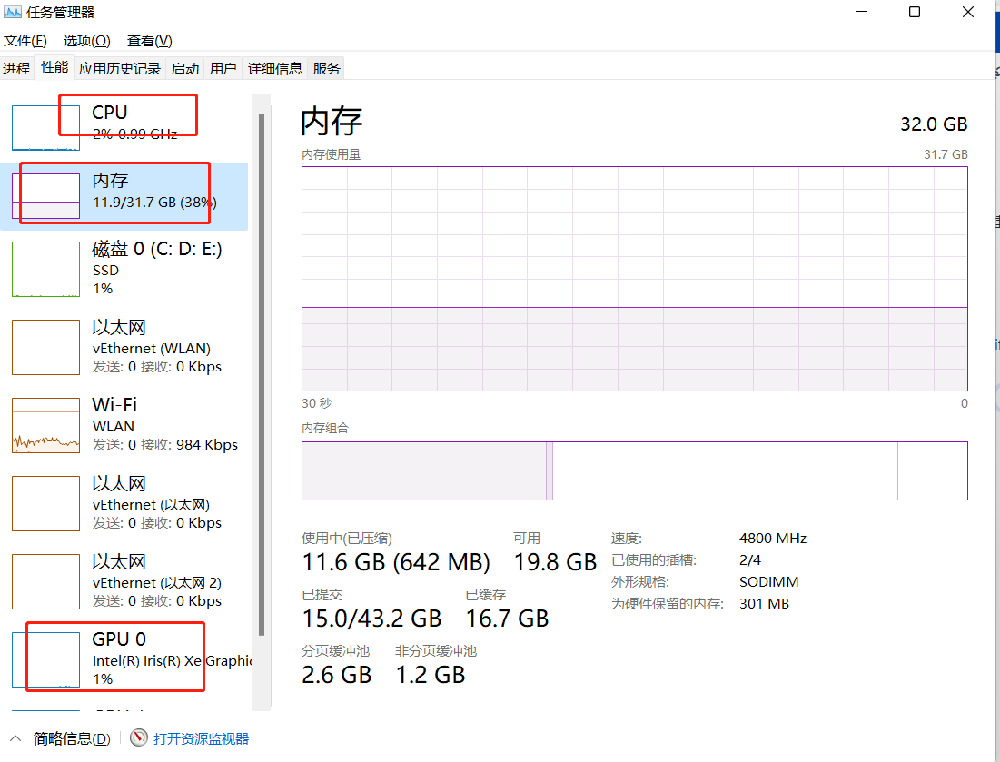

## 目的

一般来说，我们可以通过开发者工具的 performance 和 memory 面板分析页面性能及内存开销情况。但这两者只能用来分析 js 内存。Canvas 创建以及在绘制过程中主要消耗的是 GPU 内存，GPU 内存和 js 内存又不一样。在 Canvas 白板技术方案选择中，当绘制大量元素时，我们重点关注的是：

- 1.页面是否卡顿（即是否掉帧）。

- 2.内存开销，主要是 GPU 内存开销。

因此，我们需要一种手段来衡量 canvas 绘制性能，才能更好的选择优化方案。这里我采用下面几种方式：

- 1.帧率

- 2.Chrome 任务管理器查看 GPU 内存和 JS 内存消耗情况

- 3.Chrome 开发者工具性能监视器

- 4.系统任务管理器查看系统内存、CPU、GPU 开销情况

为了让数据真实客观，在调研过程中，我一般采用绘制 5000 个、10000 个、15000 个元素，分析不同数据量下 canvas 绘制的性能开销

## 帧率

打开谷歌浏览器开发者工具，window 系统按 ctrl+shift+p，选择显示帧率

就可以看到帧率面板

帧率面板可以帮助我们分析 canvas 在大数据量绘制时，是否会掉帧(即卡顿)。是一个很好的分析手段，建议在调试 canvas 时，时刻打开这个面板

## Chrome 任务管理器

chrome 任务管理器可以帮助我们查看 canvas 内存开销，包括 GPU 内存和 JS 内存。window 操作系统按 shift + esc 即可调出该面板。使用这种手段，可以明确知道当前标签页所使用的 GPU 内存和 JS 内存开销。

## Chrome 开发者工具性能监视器

也可以通过 Chrome 开发者工具性能监视器查看

## 系统任务管理器

可以使用系统自带的任务管理器查看内存、CPU、GPU 波动情况，这种在大数据量时波动才明显。无法分析某个进程或者某个标签页的具体使用情况

## 小结

在实践中，我们一般采用的是前面两种手段，因为这两种手段已经可以满足我们分析 canvas 性能。

1.帧率。可以分析页面是否掉帧，是否卡顿

2.Chrome 任务管理器。可以帮助我们分析 GPU 内存、JS 内存开销。
