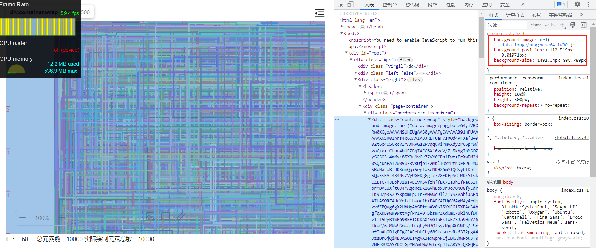
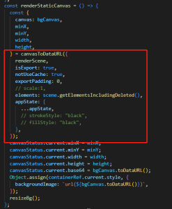
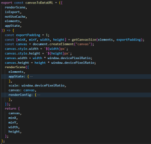
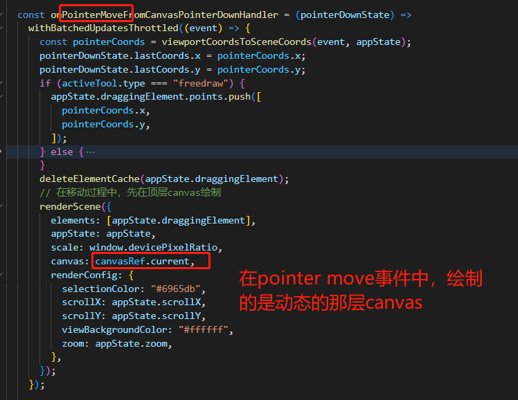
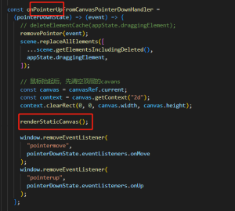
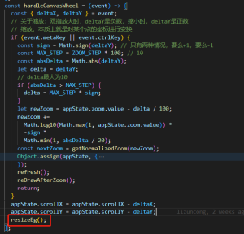
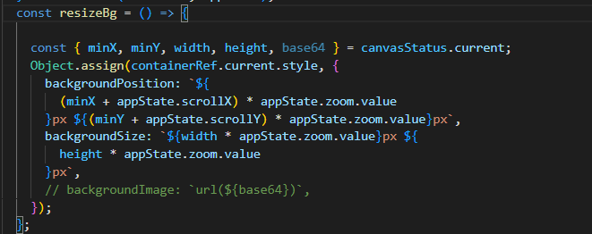
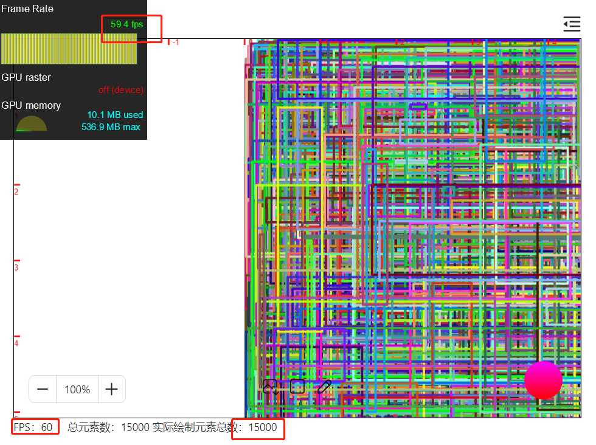

## 前言

在上一节我们使用可视区域内（即局部）绘制的手段，稍稍提升了下 canvas 绘制性能。但是在缩小时再平移，还是有明显的卡顿现象。本节我们介绍一种使用 background image、background position、background size 等纯 css 手段提高平移缩放的性能。

## 基本原理

在编辑元素，比如绘制、修改元素属性时，现在动态的 canvas 上绘制。编辑操作完成后，我们将所有的元素全量绘制到一个离屏 canvas，并转化成 base64，使用 background image 设置成容器背景。在平移时，使用 background position 改变背景图片的位置。在缩放时，使用 background size 设置图片大小。从而达到平移缩放的效果。如下图所示

## 实现

首先封装一个 canvasToDataUrl 方法

创建一个临时 canvas，并调用 renderScene 绘制全部的元素。绘制完成，调用 canvas.toDataURL()方法转成 base64，并赋值给容器的 background image 属性，如上图所示。

监听 pointer move 事件，在动态的 canvas 上绘制正在编辑的元素

监听 pointer up 事件，在编辑操作完成后，清空动态的 canvas，并将所有元素绘制生成图片。

监听平移缩放事件，计算偏移量和缩放系数，这里需要注意 resizeBg 方法

这个方法根据计算后的偏移量和缩放系数，调整容器的 backgroundPosition 和 backgroundSize 属性，以此达到平移缩放目的。

## 效果

使用这种手段后，即使是 15000 个元素，平移缩放比德芙还丝滑，从左下角的 fps 也可以看出，基本不会卡住主线程。注意，这里是左下角，左下角是我自己实现的，在主线程调用 raf 手动计算这个帧率，和左上角的浏览器自带的还有点不一样。

## 小结

如果我们仔细观察左上角的浏览器自带的那个帧率，会发现在平移缩放时，还是会有些卡顿，那些黄色的就代表浏览器绘制时略微卡顿。
