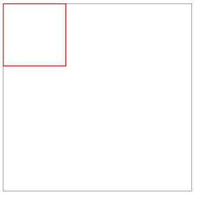
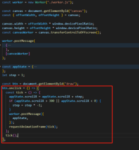
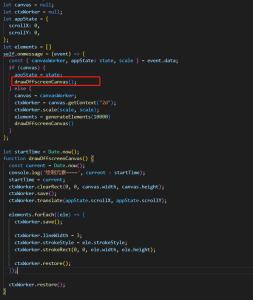
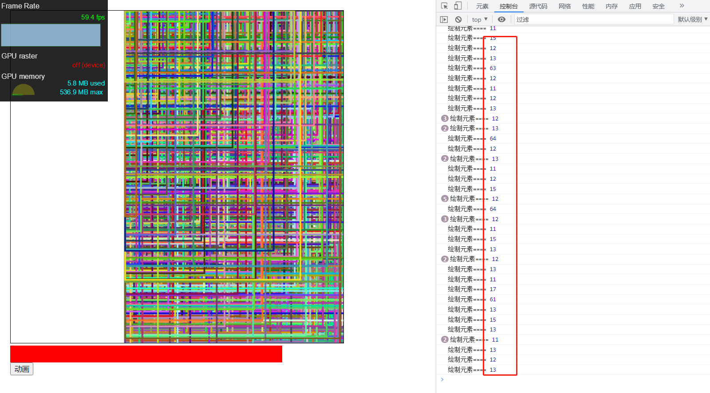
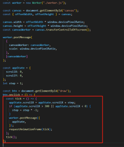
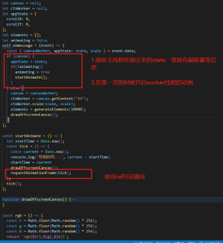
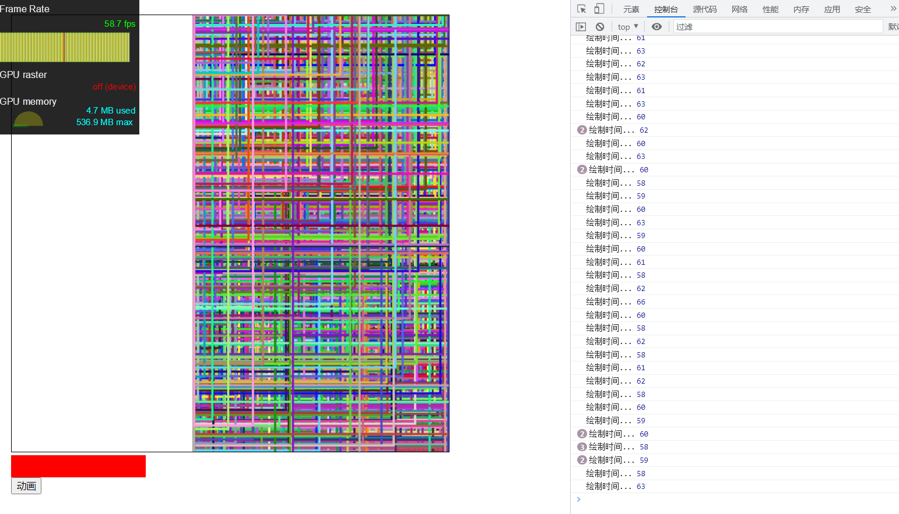

## 前言

在开始介绍 offscreen canvas + web worker 全量绘制元素前，我们先来了解下 offscreencanvas 在 web worker 中的基本使用，以及 web worker 高频拥堵的问题。

## 基本原理

web worker 是不能操作 DOM 的。OffscreenCanvas 比较特殊，既可以在主线程中绘制，也可以在 web worker 线程绘制。一个简单的 offscreencanvas+web worker 应用如下：

```html
<!DOCTYPE html>
<html lang="en">
  <head>
    <meta charset="utf-8" />
    <meta name="viewport" content="width=device-width, initial-scale=1" />
    <meta name="theme-color" content="#000000" />
    <title>OffscreenCanvas Demo</title>
    <style>
      body {
        margin: 0;
        padding: 20px;
      }
      .canvas {
        width: 600px;
        height: 600px;
        border: 1px solid black;
      }
    </style>
  </head>

  <body>
    <div id="root">
      <canvas id="canvas" class="canvas"> 绘制canvas </canvas>
    </div>
    <script>
      const worker = new Worker("./canvas_worker.js");

      const canvas = document.getElementById("canvas");
      const { offsetWidth, offsetHeight } = canvas;

      canvas.width = offsetWidth * window.devicePixelRatio;
      canvas.height = offsetHeight * window.devicePixelRatio;
      const canvasWorker = canvas.transferControlToOffscreen();

      worker.postMessage(
        {
          canvasWorker: canvasWorker,
          scale: window.devicePixelRatio,
        },
        [canvasWorker]
      );
    </script>
  </body>
</html>
```

canvas_worker.js 如下：

```js
let canvas = null;
let ctxWorker = null;

self.onmessage = (event) => {
  const { canvasWorker, scale } = event.data;
  if (canvas) {
    drawOffscreenCanvas();
  } else {
    canvas = canvasWorker;
    ctxWorker = canvas.getContext("2d");
    ctxWorker.scale(scale, scale);
    drawOffscreenCanvas();
  }
};

function drawOffscreenCanvas() {
  ctxWorker.clearRect(0, 0, canvas.width, canvas.height);
  ctxWorker.save();

  ctxWorker.lineWidth = 3;
  ctxWorker.strokeStyle = "red";
  ctxWorker.strokeRect(0, 0, 200, 200);

  ctxWorker.restore();
}
```

页面展示如下：



可以看到，我们在主线程中通过 postmessage 将 canvas 所有权传递给了 worker 线程，并实现在 worker 线程中绘制 canvas 的能力。这样的好处在于，即使在 canvas 中绘制大量的元素，比较耗时，也不会阻塞主线程。

## 高频拥堵

如果我们在 worker 线程中执行耗时的操作，比如 drawCanvas 绘制大量元素，然后主线程频繁通过 postmessage 给 worker 线程发消息触发 drawCanvas 执行，那么会造成 worker 线程卡顿，但主线程不会被卡的现象，即高频拥堵。来看下面的例子。

在主线程中，当点击动画按钮时，通过 raf 每隔 16.6 毫秒就调用 postmessage 给 worker 线程发送重绘的消息。



然后在 worker 线程中，当收到来自主线程的消息时，都重新调用 drawOffscreenCanvas 重绘 OffscreenCanvas。



这里我将调用 drawOffscreenCanvas 的时间间隔打印了出来。看下效果：



当点击动画时，可以发现 canvas 绘制卡顿，但是主线程并不卡顿，这个可以通过左上角的帧率看出，同时控制台打印的时间间隔比较接近于主线程给 worker 发消息的间隔，即 16.6 毫秒。那为什么绘制还是很卡顿？

绘制卡顿的根本原因在于，每调用一次 drawOffscreenCanvas，都会执行一次清空 canvas，重新绘制的操作。这里我们绘制了 10000 个元素，绘制一次需要的时间大概在 100 多毫秒。然而，我们从主线程中接收到的绘制信息是，每 16.6 毫秒绘制一次。这就导致一个问题，当前 canvas 正在绘制，就又收到绘制的请求，就会出现一种现象，绘制了一半，就又清空重新绘制。累积起来，就会在视觉上卡顿的效果。

知道了问题的根源，我们应该怎么解决？

## 为什么需要关注高频拥堵的问题？

为什么需要关注高频拥堵的问题？因为在画布中，这种触发重绘的操作是比较常见的。我们需要在主线程中监听 pointer move 或者平移缩放操作，然后通知 worker 线程重新绘制，这种操作是非常频繁的。

## 在 worker 中使用 requestAnimationFrame

其实要解决上面的问题也很简单。我们还是通过主线程给 worker 线程频繁发消息，将偏移量等 appState 信息传递给 worker 线程。在 worker 线程中，使用 requestAnimationFrame 启动一个动画



worker 线程的实现。worker 线程的逻辑也很简单，首先在第一次的时候启动一个 raf 循环。接收主线程传递过来的状态信息



效果如下，可以发现，这次绘制不会很卡顿，效果比之前稍稍平滑了，同时，由于绘制一次比较耗时大概需要 66 毫秒，所以两次 drawOffscreenCanvas 的时间间隔大概在 66 毫秒


