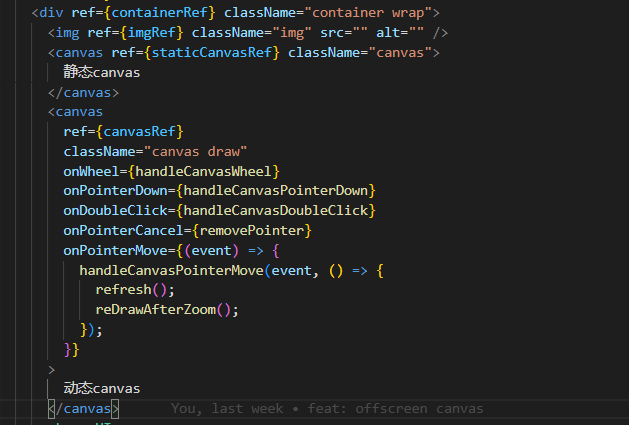
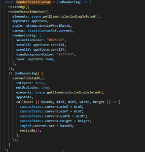
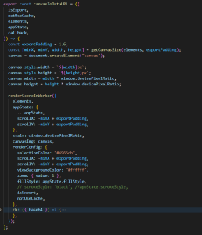
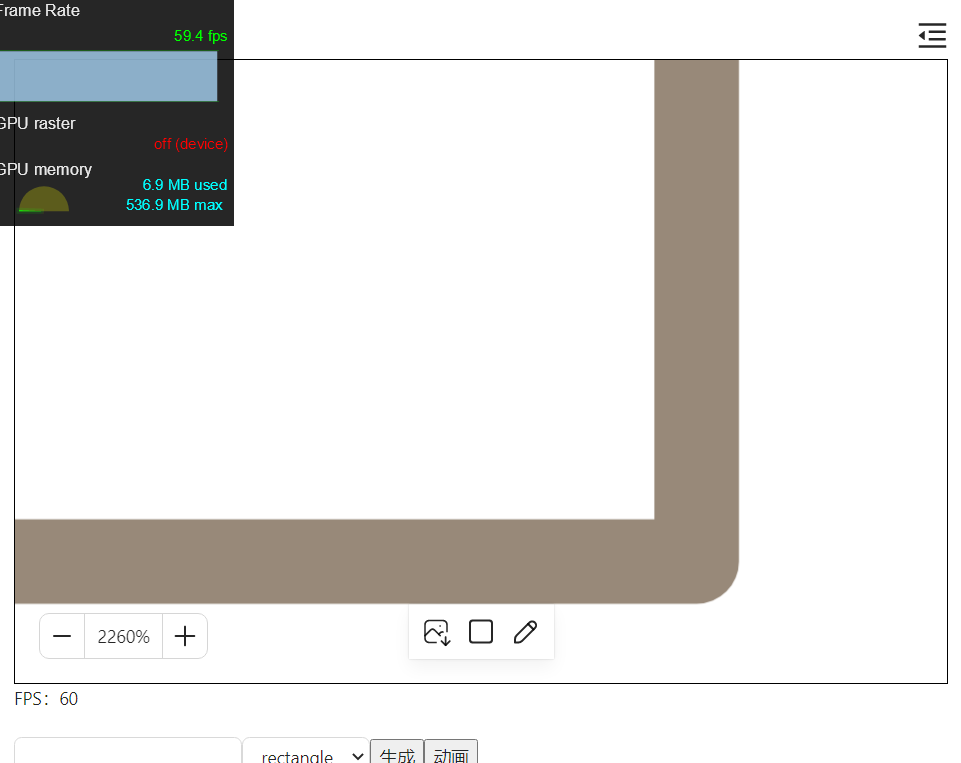
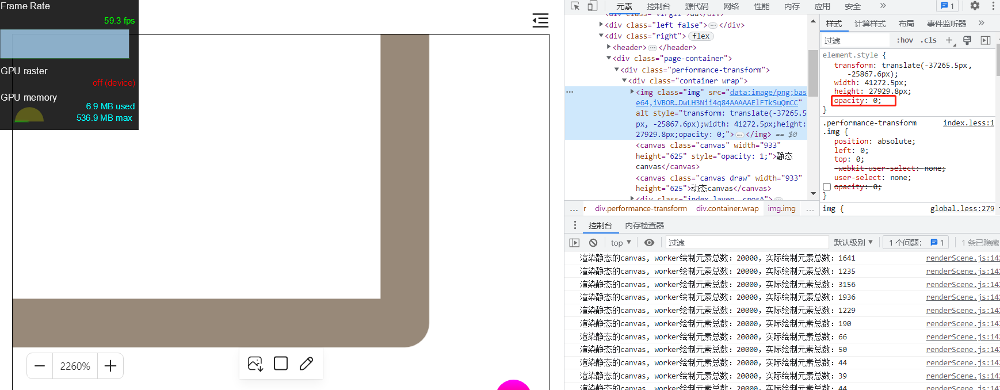
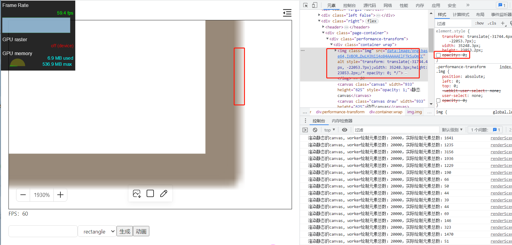

## 前言

之前我们实现了基于图片 img 的平移缩放，效果还不错。我们需要在用户操作完后，比如修改元素属性，绘制全量的元素并生成图片。这种方案的瓶颈就在于绘制全量的元素，这个是比较耗时的，容易卡顿。因此，我们可以将这个绘制的操作放在 worker 线程执行

## 基本原理

为了解决生成图片耗时、放大时图片模糊的问题，采用以下两种手段：

1.只在元素改变时，比如绘制新的元素、修改旧的元素的属性，才重新生成图片

2.一层静态 canvas，一层图片。在平移、缩放操作的过程中，操作的都是图片，此时图片显示，静态 canvas 隐藏。平移缩放操作完成后，隐藏图片，重新绘制静态的 canvas，并且只绘制可视区域内的元素。

## 具体实现

如下，动态的 canvas 负责正在编辑的操作，比如绘制新元素，改变旧元素。操作完成后，重新绘制旧的静态的 canvas，然后生成图片并赋值给 img。在没有操作时，img 元素透明度设置成 0 隐藏。在平移缩放时，img 透明度设置成 1 显示，静态的 canvas 透明度设置成 0 隐藏。

修改代码，renderStaticCanvas 添加一个参数 reRenderImg 控制是否需要重新生成图片。

canvasToDataURL 同样调用 renderSceneInWorker 绘制全量的元素并生成新的图片

renderSceneInWorker 就是在 worker 中绘制 canvas

## 效果

如下图，可以看到，我们放大后，元素依然清晰。这是因为我们重新绘制并显示静态那层 canvas。同时还可以兼顾平移缩放的性能

此时 img 隐藏，静态的 canvas 显示。

## 小结

这种方案唯一的不足时，由于 css transform 的偏移和静态的 canvas 绘制时的偏移有些差异，导致 img 和静态的 canvas 会有些偏移，在视觉上就会有抖动。如下图所示，我将 img 显示出来，可以发现并没有和静态的那层 canvas 完全重合，图中模糊的部分就是 img 偏移出来的一部分。

这个差异可能是因为元素的坐标导致的。这个差异是由于元素坐标的小数点导致的。

因此，这种方案理论上是比较完美的，但是实际操作还是比较麻烦，需要注意元素抖动这些问题
