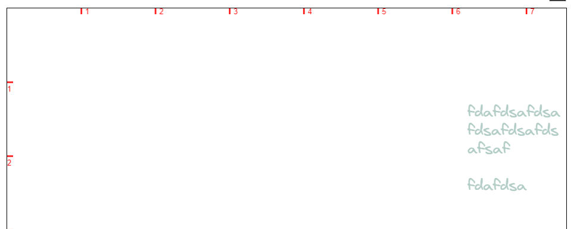

## 前言

我们需要实现在 canvas 上双击，出现光标，然后可以在上面输入文字，效果如下：

这个功能的难点在于：

1.canvas 绘制时，需要保持字体样式比如行高、字体等一致

2.需要支持手动换行、触碰到 canvas 边缘时自动换行

3.canvas 绘制文本的 API 不支持绘制多行文本，应该怎么实现？

## 基本原理

当双击画布时，我们在 canvas 上覆盖一层透明的 textarea 元素用于接收用户的输入。在显示时，同时将该元素的样式复制到 textarea 的样式上。同时，由于 canvas 不支持绘制多行文本，只能一行一行绘制。因此我们在接收用户的文本输入时，还需要分隔文本，在文本换行的地方插入换行符。如果是手动换行，浏览器会自动帮我们插入换行符。这里最麻烦的就是自动换行。在 textarea 或者 input 输入框中，自动换行是不会插入换行符的，需要我们特殊处理。

社区上，比如开源的 excalidraw，会计算输入的每个字符的宽度，然后和输入框的宽度或者容器宽度比较。如果输入的文本宽度大于容器宽度，则手动插入一个换行符。这种方式实现比较麻烦，同时每次输入一个字符，都需要构造一个离屏 dom 渲染然后获取真实的宽度。性能较差。

在我们的实现中，采用一个透明的 textarea 输入框接受用户输入，同时在页面上使用一个透明的 div 接收用户的输入，如果这个透明的 div 宽度大于 textarea 的宽度，则插入换行符。如下图所示，这里为了方便观察，我将两个元素的背景色设置为灰色。

## 具体实现

监听 canvas 的 double click 双击事件。显示 textarea，并计算 textarea 的宽度，这一步主要是为了让用户输入的文字能够在触碰到 canvas 边缘时自动换行。

监听 textarea onchange 事件，每次输入，都将文本同时赋值给透明的 div 用于判断是否需要插入换行符。

以上基本就可以实现输入的时候插入换行符。但是还没法处理粘贴文本的情况。由于粘贴文本会引起透明的 div 宽度陡然增大，没法通过现有的方式处理。因此只能对粘贴进来的文本逐个字符处理

由于我们监听 textarea 的 onchange 事件，每次输入，都将文本复制到透明的 div，如果页面比较复杂的情况下，频繁的回流重绘性能较差。因此可以将这层透明的 div 分层渲染。比如添加 transform 等硬件加速属性。

在 canvas 绘制时，我们可以使用换行符分隔文本，并一行一行绘制

