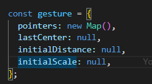
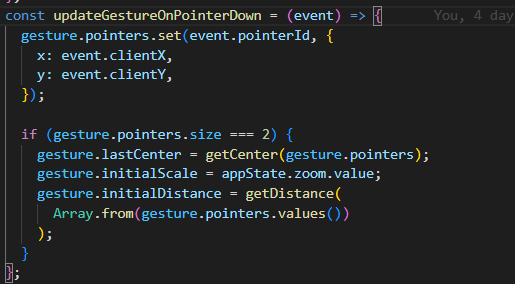
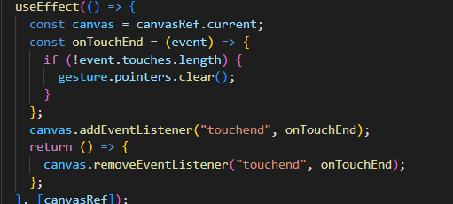
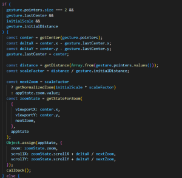

## 前言

目前为止，我们已经实现了无限画布、缩放等基本操作。但是还没实现移动端事件，比如移动端滑动画布、双指缩放等。

## 基本原理

在双指移动的过程中，包含两个操作：

1.平移画布

2.缩放画布

对于平移画布，可以通过计算移动过程中，双指中心点的位移计算 deltaX 和 deltaY。因此，在平移的过程中我们需要记录上一次双指的中心点位置 lastCenter，然后和当前 center 比较

对于缩放，可以记录双指接触画布当前时间点，双指的初始距离 initialDistance、当前画布的初始缩放比例 initialScale 等参数。在移动过程中，计算双指的距离并和一开始的距离的比例，从而得出当前时间点的缩放比例

## 实现

由于 pointer down 和 pointer move 事件能够兼容 pc 和移动端。因此，我们可以采用 pointer 事件。在移动端，每一个触摸事件，浏览器都会分配一个唯一的 event.pointerId。因此我们可以维护一个全局的变量 gesture

监听 canvas 的 pointer down 事件，每触发一次事件，都将当前 pointer 保存，使用 event.pointerId 作为键。如果 pointers 中有两个事件，则说明开始双指操作，记录当前画布缩放比例，并计算当前双指的距离。

监听 canvas 的 touchend 事件，如果没有触摸点，则清空 gesture

监听 pointer move 事件，计算偏移量和缩放比例

上面的手势代码我已经封装成一个 useGesture hook，可以拿来即用
