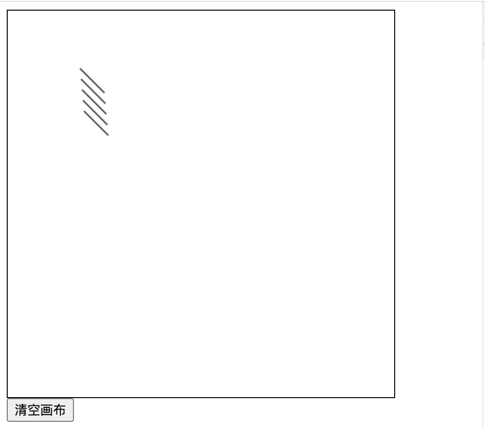
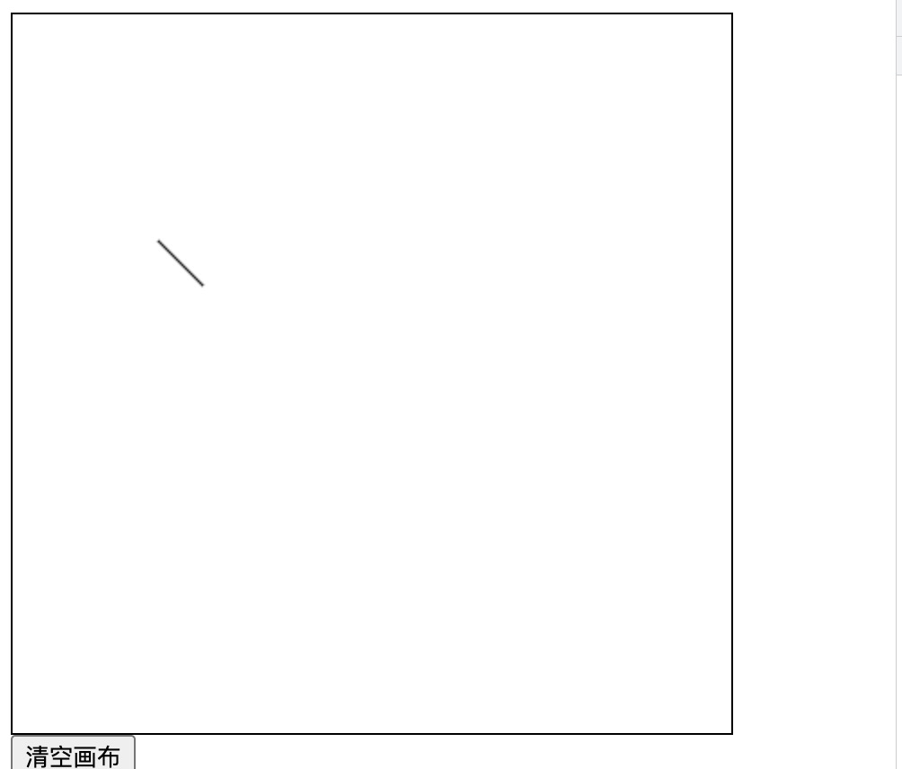
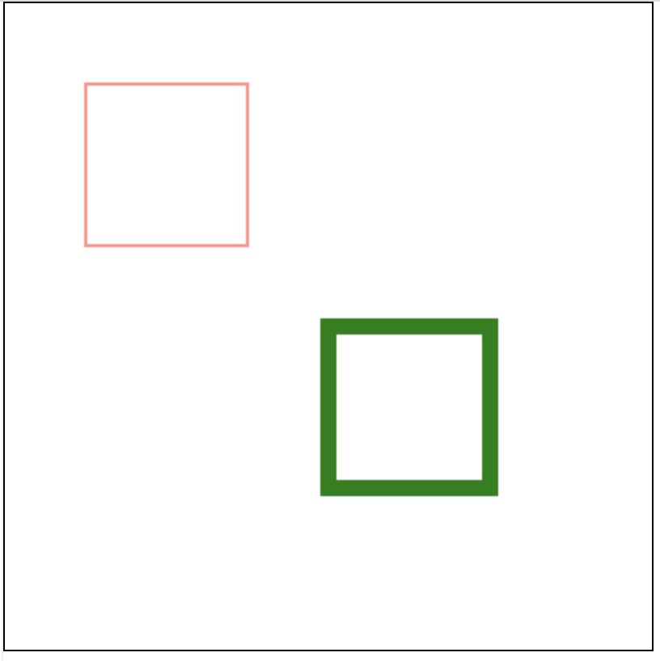
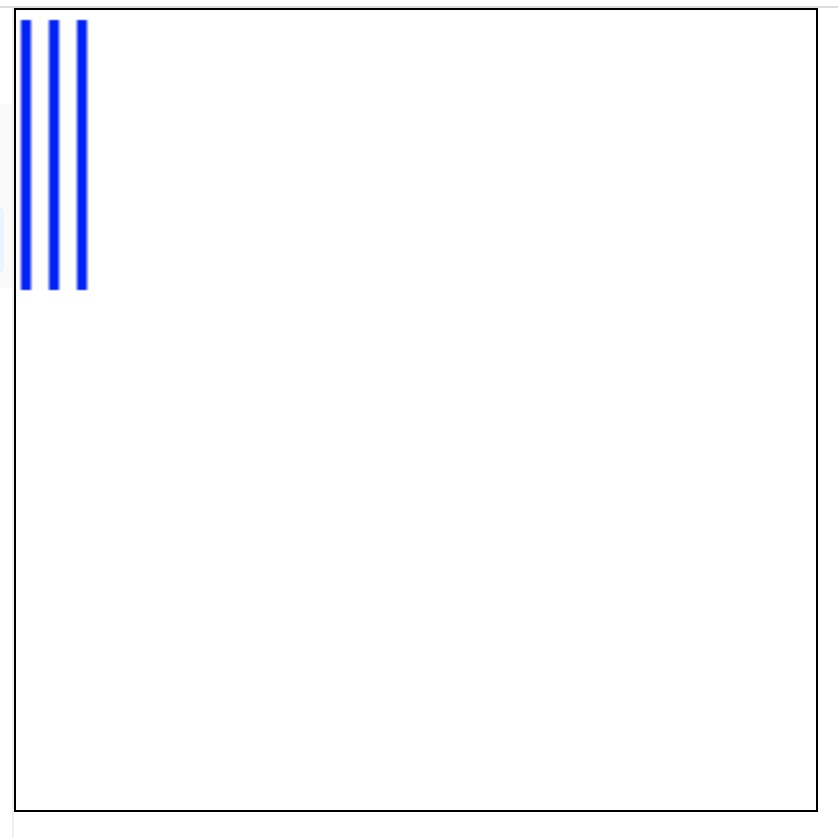
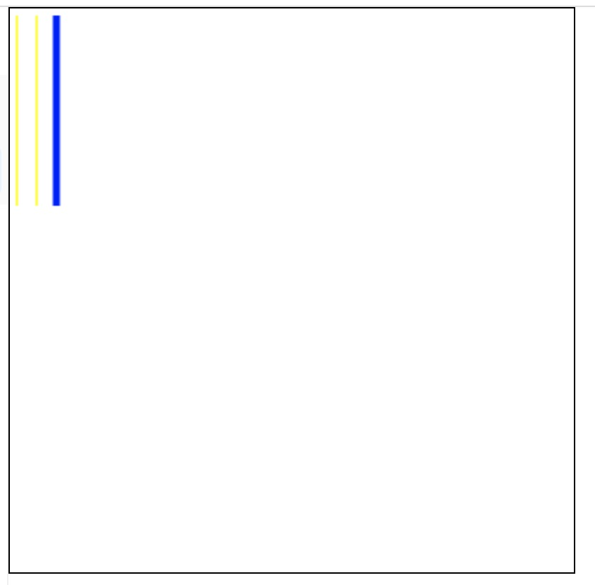

## canvas 基础知识

- 当没有设置宽度和高度时，canvas 会初始化宽度为 300px 和高度为 150px
- 可以使用 CSS 来定义 canvas 大小，但在绘制时 canvas 会伸缩以适应它的框架尺寸：如果 CSS 的尺寸与初始画布的比例不一致，它会出现扭曲。
- 不同于 SVG，canvas 只支持两种形式的图形绘制：矩形和路径（由一系列点连成的线段）。所有其他类型的图形都是通过一条或者多条路径组合而成的。不过，canvas 提供了众多路径生成的方法让复杂图形的绘制成为了可能

> 图形的基本元素是路径

## 绘制矩形

canvas 提供了三种方法绘制矩形：

- fillRect(x, y, width, height)。绘制填充的矩形
- strokeRect(x, y, width, height)。绘制矩形的边框
- clearRect(x, y, width, height)。清除指定矩形区域，让清除部分完全透明。

## 绘制路径

图形的基本元素是路径。路径是通过不同颜色和宽度的线段或曲线相连形成的不同形状的点的集合。**一个路径，甚至一个子路径，都是闭合的**

绘制路径的步骤：

- 调用 beginPath()创建路径起始点。
- 使用画图命令绘制路径
- 调用 closePath()把路径封闭。这一步不是必需的
- 一旦路径生成，就可以通过描边 stroke 或者填充 fill 路径区域来渲染图形

以下几点需要注意：

- 闭合路径 closePath(),不是必需的。这个方法会通过绘制一条从当前点到开始点的直线来闭合图形。如果图形是已经闭合了的，即当前点为开始点，该函数什么也不做。
- 调用 fill() 函数时，所有没有闭合的形状都会自动闭合，所以不需要调用 closePath() 函数
- 调用 stroke() 时不会自动闭合

### beginPath 详解

本质上，路径是由很多子路径构成，这些子路径都是在一个列表中，所有的子路径（线、弧形、等等）构成图形。而每次调用 beginPath 后，列表清空重置，然后我们就可以重新绘制新的图形

**重点需要理解子路径都是在列表中，beginPath 每次都会清空重置列表**，以下面的例子为例：

```html
<html>
  <head>
    <title>Canvas tutorial</title>
    <style type="text/css">
      canvas {
        border: 1px solid black;
      }
    </style>
  </head>

  <body>
    <canvas
      width="400"
      height="400"
      id="tutorial"
      width="150"
      height="150"
    ></canvas>
    <div><button id="btn">清空画布</button></div>
    <script type="text/javascript">
      var canvas = document.getElementById("tutorial");
      if (canvas.getContext) {
        var ctx = canvas.getContext("2d");
      }
      var x = 0;
      var y = 0;
      function draw() {
        ctx.save();
        // ctx.beginPath();
        ctx.translate(x++, y++);
        ctx.moveTo(75, 50 + 10 * y);
        ctx.lineTo(100, 75 + 10 * y);
        ctx.stroke();
        ctx.restore();
      }
      draw();

      btn.onclick = () => {
        ctx.clearRect(0, 0, canvas.width, canvas.height);
        setTimeout(() => {
          draw();
        }, 2000);
      };
    </script>
  </body>
</html>
```

`draw`方法每次绘制一条直线，当我们点击清空画布按钮时，会先调用 clearRect 清空画布，然后启动定时器 2 秒后开始绘制。**按我们的理解，定时器重新绘制时，应该是只绘制一条直线。但实际情况并非如此**，多次点击按钮，页面效果如下：



这是因为当我们每次调用 draw 时，都会重新绘制一条新的直线，并添加到路径列表中，在下一次绘制时，列表中的路径都会被绘制。因此我们在下一次绘制时，需要调用 beginPath 清空重置之前的路径列表，如下：

```js
function draw() {
  ctx.save();
  ctx.beginPath();
  ctx.translate(x++, y++);
  ctx.moveTo(75, 50 + 10 * y);
  ctx.lineTo(100, 75 + 10 * y);
  ctx.stroke();
  ctx.restore();
}
```

每次 draw 都调用 beginPath 清空重置路径列表，效果如下：



可以看到效果和我们预期一样

> 因此，一个良好的习惯时，每次开始绘制新的图形时，都调用 beginPath 重置路径列表。当然绘制矩形就不存在这个问题

#### 样式和颜色

绘制路径和绘制矩形的样式设置有些区别。

绘制矩形时，当我们调用 ctx.strokeRect 或者 ctx.fillRect 时，样式以调用 strokeRect 或者 fillRect 方法之前设置的为主，因此下面这段代码绘制的两个矩形颜色，线宽不同

```js
function drawRect() {
  ctx.lineWidth = 1;
  ctx.strokeStyle = "red";
  ctx.strokeRect(50, 50, 100, 100);
  ctx.lineWidth = 10;
  ctx.strokeStyle = "green";
  ctx.strokeRect(200, 200, 100, 100);
}
```



但是，绘制路径时，情况就稍稍不同。如果我们需要绘制不同样式或者颜色的路径，需要在绘制前调用 beginPath

```js
function draw() {
  ctx.lineWidth = 1;
  ctx.strokeStyle = "red";
  ctx.moveTo(5, 5);
  ctx.lineTo(5, 140);
  ctx.stroke();

  ctx.lineWidth = 2;
  ctx.strokeStyle = "yellow";
  ctx.moveTo(19, 5);
  ctx.lineTo(19, 140);
  ctx.stroke();

  ctx.lineWidth = 5;
  ctx.strokeStyle = "blue";
  ctx.moveTo(33, 5);
  ctx.lineTo(33, 140);
  ctx.stroke();
}
```

上面的代码本意是希望能绘制三条颜色、线宽不同的线段，但实际效果如下：



如果我们在 ctx.lineWidth = 5 前面调用 beginPath，如下：

```js
function draw() {
  ctx.lineWidth = 1;
  ctx.strokeStyle = "red";
  ctx.moveTo(5, 5);
  ctx.lineTo(5, 140);
  ctx.stroke();

  ctx.lineWidth = 2;
  ctx.strokeStyle = "yellow";
  ctx.moveTo(19, 5);
  ctx.lineTo(19, 140);
  ctx.stroke();

  ctx.beginPath(); // 重新绘制新的路径
  ctx.lineWidth = 5;
  ctx.strokeStyle = "blue";
  ctx.moveTo(33, 5);
  ctx.lineTo(33, 140);
  ctx.stroke();
}
```

效果如下：



> 从上面可以看出，如果我们需要绘制不同样式或者颜色的路径，需要调用 beginPath。如果没有调用 beginPath，那么所有路径的样式或者颜色都以最后一次设置的为主
