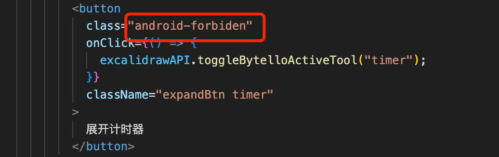

## 方案简述

前端白板在安卓系统书写性能很差，不跟手。需要通过伪加速提高书写速度。总的来说就是，前端和安卓同时在绘制，绘制完成后，安卓再清空安卓端的笔迹，只保留前端的笔迹，从而达到加速的效果。

在绘制的过程中，前端绘制的笔迹和安卓绘制的笔迹要完全重合，肉眼才能看不出笔迹有偏移。理论上，只要满足下面两个条件，就能实现前端和安卓笔迹的完全重合：

- 1.前端和安卓两端采的点集合一致

- 2.前端和安卓使用的贝塞尔曲线算法一致，比如控制点的计算方式等。贝塞尔曲线主要解决书写圆滑的问题。

但在实践过程中，由于小数点等各方面的原因，造成两端绘制的笔迹总是有一些差异。下面就针对实现过程中遇到的一些比较困难的问题进行分析。

## 前端和安卓同时绘制

下面视频是前端和安卓同时绘制，各自采点。红色线是前端绘制的笔迹，黑色线是安卓绘制的笔迹。从视频中前端笔迹和安卓大概率会出现笔迹不重叠的现象，特别是书写速度快、笔迹弯曲的场景下。

<video
src="../../excalidraw-app/same.mp4" controls=""
height=400 
width=600>
</video>

造成上面笔迹不重叠的原因是，前端是每帧采一次点，而安卓采的点就比较密集，在移动的过程中不断采点。因此两端采的点集合不同，即使使用相同的贝塞尔曲线，两端绘制的笔迹也有可能会不一样的。

### 解决方法

前端采用安卓的传点并绘制

```js
this.jSBridge.wDrawPushEvent = ({ changedTouches }: any) => {
  const point = changedTouches[0];
  if (point.type === "touchstart") {
    CURRENT_FREEDRAW_ANDROID_ELEMENT.current =
      this.boardApp?.handleAndroidFreeDrawElementOnPointerDown({
        clientX: point.clientX,
        clientY: point.clientY,
      });
    startPoint = point;
  }

  if (point.type !== "touchstart") {
    const dx = point.clientX - startPoint.clientX;
    const dy = point.clientY - startPoint.clientY;
    this.boardApp?.handleAndroidFreeDrawElementOnPointerMove(
      { dx, dy },
      CURRENT_FREEDRAW_ANDROID_ELEMENT.current
    );
  }
  if (point.type === "touchend") {
    this.boardApp?.handleAndroidFreeDrawElementOnPointerUp(
      point,
      CURRENT_FREEDRAW_ANDROID_ELEMENT.current
    );
  }
};
```

## DPR 以及画布缩放比例的影响

安卓 webview window.devicePixelRatio 为 3 的情况下，前端绘制的笔迹会比安卓绘制的大，明显不合理，如下面视频所示：
<video
src="../../excalidraw-app/dpr_01.mp4" controls=""
height=400 
width=600>
</video>
这是因为在计算偏移量时，需要考虑 dpr 的影响。安卓传的点比实际的大，因此需要抵消：

```js
if (point.type !== "touchstart") {
  const dx = (point.clientX - startPoint.clientX) / window.devicePixelRatio;
  const dy = (point.clientY - startPoint.clientY) / window.devicePixelRatio;
  this.boardApp?.handleAndroidFreeDrawElementOnPointerMove(
    { dx, dy },
    CURRENT_FREEDRAW_ANDROID_ELEMENT.current
  );
}
```

纠正 dpr 后，将画布缩放比例即 zoom.value 调整为 0.7，可以看到此时前端绘制的笔迹比安卓的小，如下面视频所示：
<video
src="../../excalidraw-app/scale.mp4" controls=""
height=400 
width=600>
</video>
这是因为我们的白板比例缩小了，但是安卓的白板没有缩放，安卓依旧是按照 1 的比例绘制，而前端按照 0.7 的比例绘制，因此我们在计算偏移量时也需要考虑画布缩放比例的影响：

```js
if (point.type !== "touchstart") {
  const dx =
    (point.clientX - startPoint.clientX) /
    window.devicePixelRatio /
    this.boardApp.state.zoom.value;
  const dy =
    (point.clientY - startPoint.clientY) /
    window.devicePixelRatio /
    this.boardApp.state.zoom.value;

  this.boardApp?.handleAndroidFreeDrawElementOnPointerMove(
    { dx, dy },
    CURRENT_FREEDRAW_ANDROID_ELEMENT.current
  );
}
```

矫正 dpr 以及画板比例后的效果：
<video
src="../../excalidraw-app/dpr矫正后效果.mp4" controls=""
height=400 
width=600>
</video>

## 笔迹缩水

安卓传给前端的点是整数，理论上前端只需要按照安卓传的点正常绘制即可。但上面经过 dpr 矫正以及画板比例矫正后，又会引出新的问题。转换后的点存在小数位，精度就有问题。会导致在实际绘制时，前端笔迹和安卓笔迹重叠度不高，当安卓笔迹消失时，视觉上会有缩水的感觉。如下面视频所示：

<video
src="../../excalidraw-app/缩水优化前.mp4" controls=""
height=400 
width=600>
</video>

下面视频是优化后的效果

<video
src="../../excalidraw-app/缩水优化后.mp4" controls=""
height=400 
width=600>
</video>

原因分析：

如下面的视频所示，我们使用红色绘制前端的笔迹，黑色绘制安卓笔迹，可以发现两者并不完全重合

<video
src="../../excalidraw-app/缩水原因分析.mp4" controls=""
height=400 
width=600>
</video>

结合上面视频可以看出，前端的笔迹相比于安卓来说，水平方向稍微往左偏移了，垂直方向稍微向上偏移了，因此，我们可以通过在计算偏移量时，加上一个系数 0.18，不要问这个系数怎么来的，我也是通过一点一点尝试得来的。

```js
if (point.type !== "touchstart") {
  const offset = 0.18;
  const dx =
    (point.clientX - startPoint.clientX) /
      window.devicePixelRatio /
      this.boardApp.state.zoom.value +
    offset;
  const dy =
    (point.clientY - startPoint.clientY) /
      window.devicePixelRatio /
      this.boardApp.state.zoom.value +
    offset;
  this.boardApp?.handleAndroidFreeDrawElementOnPointerMove(
    { dx, dy },
    CURRENT_FREEDRAW_ANDROID_ELEMENT.current
  );
}
```

下面是优化后的效果，如果仔细观察黑色和红色笔迹，会发现两端重合度很高。

<video
src="../../excalidraw-app/缩水原因分析2.mp4" controls=""
height=400 
width=600>
</video>

当然，由于换算后的点包含太多的小数位，在同步到其他端时数据较大，导致同步速度变慢，因此我们还需要对点进行精简，加个 toFixed 保留 2 位小数：

```js
if (point.type !== "touchstart") {
  const offset = 0.18;
  const dx =
    toFixed(
      (point.clientX - startPoint.clientX) /
        window.devicePixelRatio /
        this.boardApp.state.zoom.value
    ) + offset;
  const dy =
    toFixed(
      (point.clientY - startPoint.clientY) /
        window.devicePixelRatio /
        this.boardApp.state.zoom.value
    ) + offset;
  this.boardApp?.handleAndroidFreeDrawElementOnPointerMove(
    { dx, dy },
    CURRENT_FREEDRAW_ANDROID_ELEMENT.current
  );
}
```

## 触摸手势冲突

优化前，双指滚动画布会出现零碎的笔迹

<video
src="../../excalidraw-app/双指滚动优化前.mp4" controls=""
height=400 
width=600>
</video>

这是因为在触摸时，会存在一个手指先触摸到屏幕，另一个手指后触摸的问题，就会导致第一个手指绘制的笔迹比较零散。因此，需要判断在多指触摸时，将多余的笔迹删除掉：

```js
this.jSBridge.wDrawPushEvent = ({ changedTouches }: any) => {
  if (changedTouches?.length > 1) {
    // 如果是多指触摸，则删除长度不足10的线段
    this.boardApp?.handleAndroidDeteleFreeDrawElementOnMultiPointerDown(
      CURRENT_FREEDRAW_ANDROID_ELEMENT.current
    );
    CURRENT_FREEDRAW_ANDROID_ELEMENT.current = null;
    return;
  }
};
```

优化后，双指滚动画布正常

<video
src="../../excalidraw-app/双指滚动优化后.mp4" controls=""
height=400 
width=600>
</video>

## 不可绘制区域

由于安卓是在最顶层覆盖了一层透明白板，因此前端页面中的一些弹窗，浮动的工具栏，安卓笔迹还是能够绘制的到，这是不合理的。

<video
src="../../excalidraw-app/不可绘制区域.mp4" controls=""
height=400 
width=600>
</video>

这里，我采用元素标记的方式，业务端只需要在元素上加上指定的标记，无需做特殊处理就可以绕过安卓的笔迹



```js
// 更新禁止绘制的区域
updateForbiddenArea() {
const areas: any = this.getCanvasBound();
const getAreas = (el: any) => {
const { left, right, top, bottom } = el.getBoundingClientRect();
const id = el.getAttribute("data-forbiden");

      areas.push({
        areaId: id || `${Math.random()}`,
        area: {
          left,
          right,
          top,
          bottom,
        },
      });
    };
    document
      .querySelectorAll(
        "[data-forbiden],.ant-modal-mask,.ant-tooltip,.android-forbiden,.excalidraw-modal-container",
      )
      .forEach(getAreas);

    this.jSBridge.updateForbiddenArea(JSON.stringify(areas));

}
```

<video
src="../../excalidraw-app/可绘制区域.mp4" controls=""
height=400 
width=600>
</video>

## 最终效果

<video
src="../../excalidraw-app/最终效果.mp4" controls=""
height=400 
width=600>
</video>
