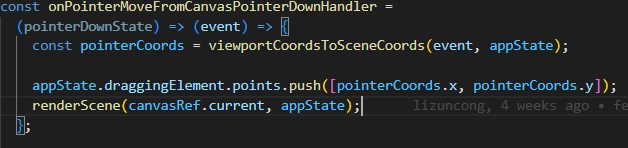
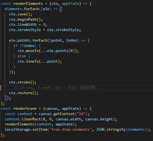
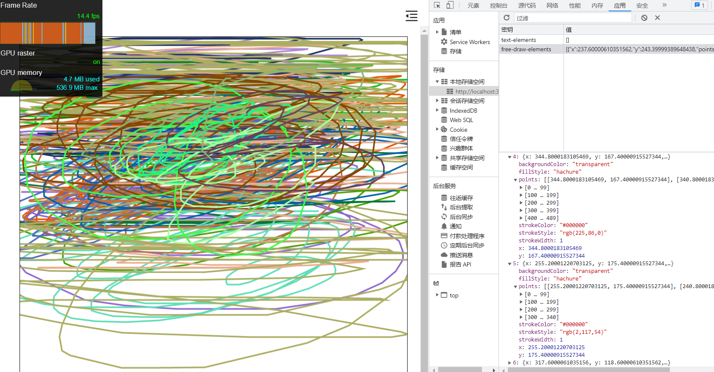
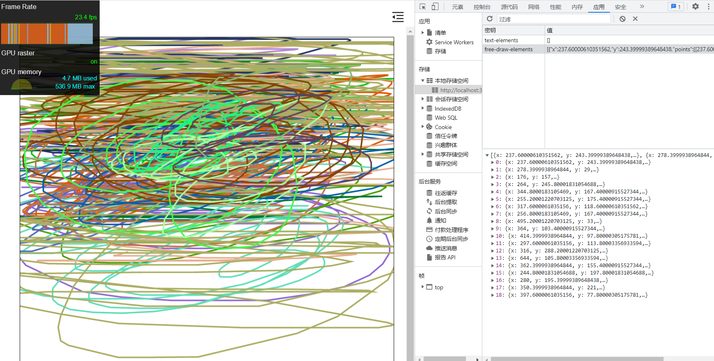
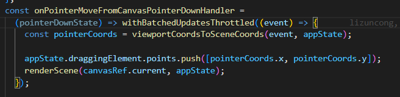
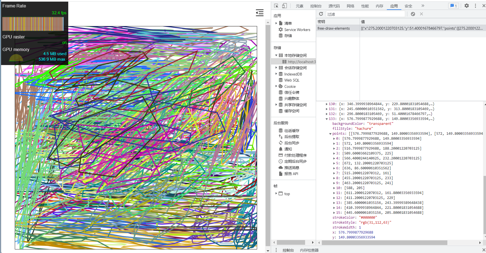

## 前言

自由书写的笔迹，是由一系列的微小线段连接而成的，自由书写的笔迹越长，所需要的微小线段越多。绘制就越耗时。因此，我们应该尽可能让绘制的点、线段越来越少

## 自由书写的实现原理

我们监听 canvas 的 pointer move 事件，然后将所有的点添加到 points 数组中。再触发 canvas 重绘

触发 canvas 重绘。遍历 points 里面的所有点，连接成线段，从而构成我们的书写笔迹。

## 点稀释前的效果

在前面的实现中，我们在 pointer move 事件中疯狂添加点，并触发重绘。如果我们绘制的笔迹很长，点就会很密集，如下图所示，一条笔迹 400 个点

这里只绘制了 18 条线，就已经到达性能瓶颈，帧率掉到 10-20 fps。性能很差

## 点稀释后的效果

所谓的点稀释，就是尽可能的让绘制所需要的点不要那么密集。要实现这个有多种方式：

1.节流。这是常见的一种方式，可以给 pointer move 事件加个节流

2.丢弃不必要的点。可以约定一个阀值，在触发 pointer move 事件的过程中，可以判断当前的点和上一个点的距离，如果小于阀值，则丢弃当前的点，不添加到数组中，同时也不触发 canvas 重绘。

这里我采用的是第一种方式，这种方式实现比较简单，同时结合 raf 能够控制点的稀释率。实现如下：

优化后的效果如下，在自由书写了 100 多次后，还能保持 30fps 的帧率，前面的好很多。同时，点不会太密集，随机抽取一个元素，可以看到点的密度比之前稀疏很多

