## 前言

浏览器为 canvas 分配的 GPU 内存是有限的，不同设备不同浏览器内核限制不同。以 Blink 内核为例，具体可以看 Blink 内核源码：

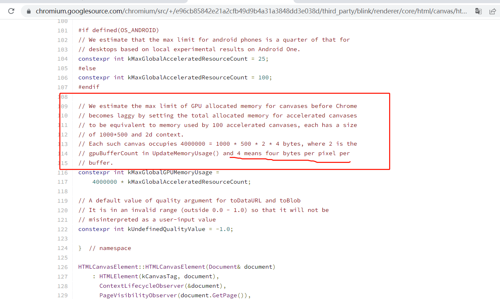

从上图中我们可以得出两个信息，在 Blink 内核的浏览器中：

- 1.面积为 1px 的 canvas 大概需要 4 字节的 GPU 内存。因此 512px \* 512px 的 canvas 大概需要 1M 的 GPU 内存。

- 2.浏览器分配给 canvas 的用于加速的 GPU 内存最大为 400MB。

实际上，canvas 还是有最大的内存限制的。在 chrome 中，这个最大限制取决于当前系统还有多少内存空间。

## 示例

### 1.当页面中没有创建任何 canvas 时

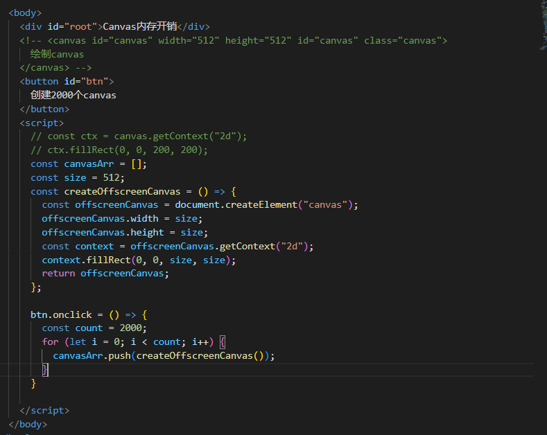

可以看到当前进程消耗的 GPU 内存如下：
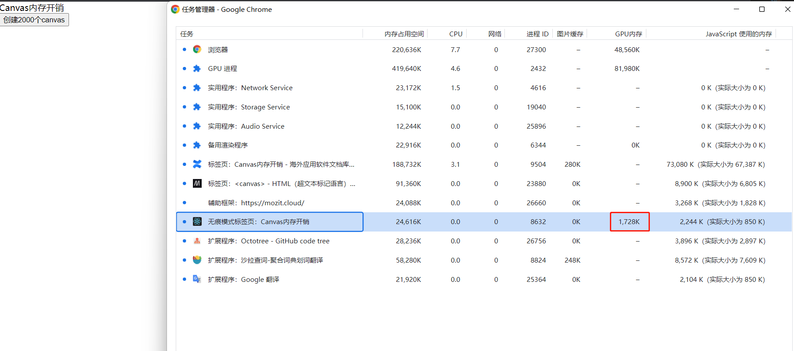

当前系统内存如下：
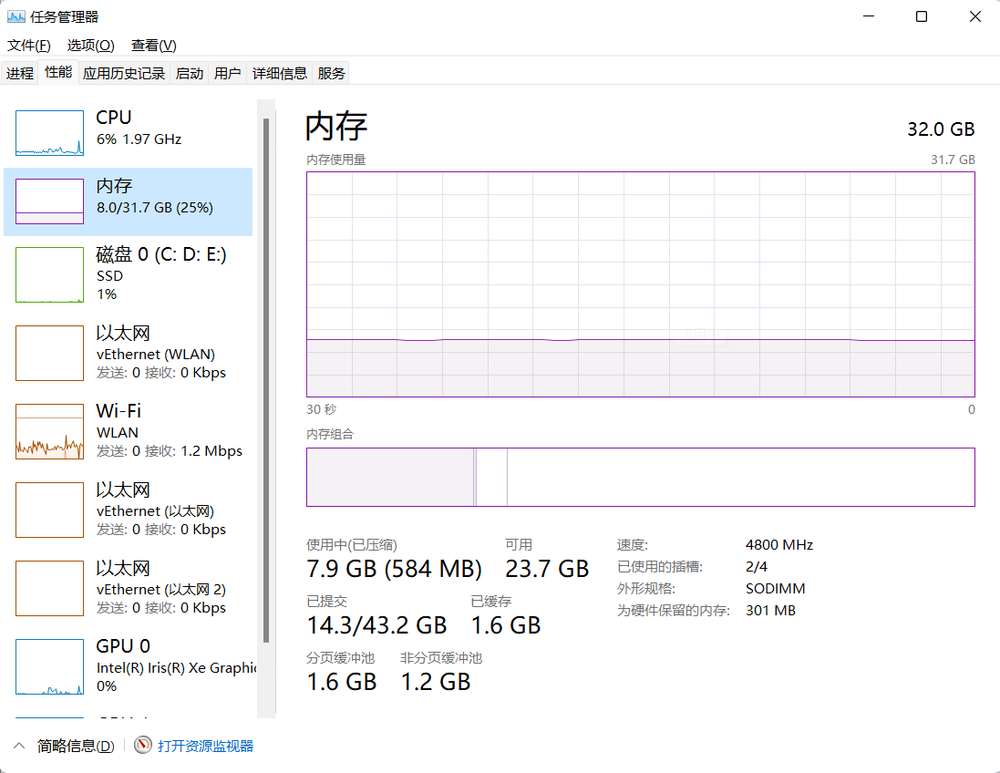

### 2.当页面只有一个 canvas 时

下面的代码创建了一个 512px \* 512px 尺寸的 canvas
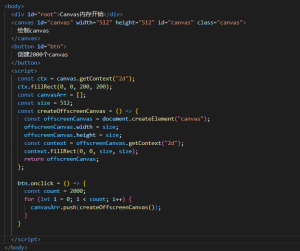

可以看到，进程消耗的 GPU 内存增加明显。增加了大概 5M，按照前面的理论，1px 的 canvas 大概 4 个字节，理论上 512px \* 512px 的 canvas 大概消耗 1MB 的 GPU 内存。这里额外增加 4MB 的内存，原因不是很了解。当然，在大数据量下，这个理论值就比较接近了。
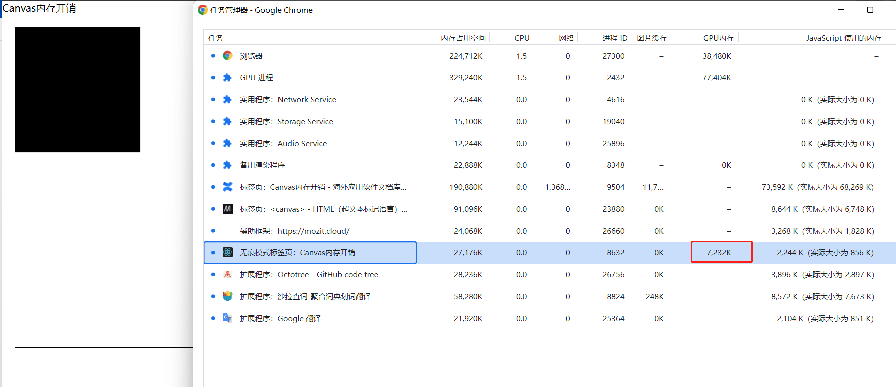

系统内存增加明显
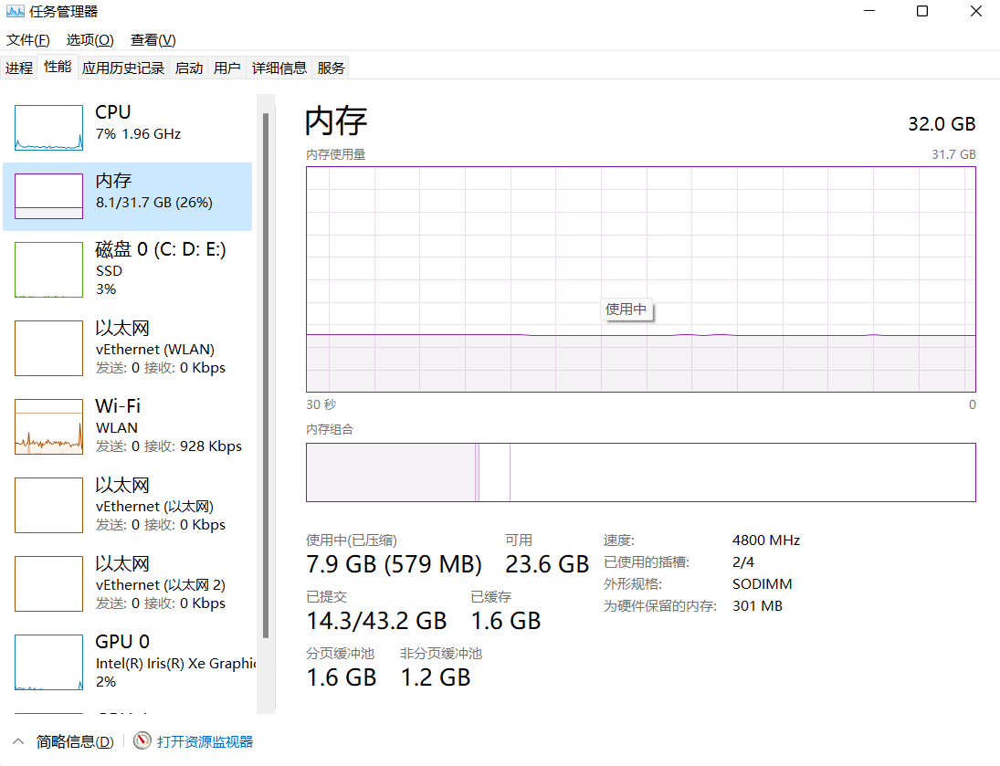

### 3.点击按钮创建 2000 个大小均为 512px \* 512px 的 canvas

这次我们增加 2000 个大小均为 512px _ 512px 的 canvas，理论上，每个 512px _ 512px 的 canvas 消耗 1MB 的 GPU 内存。从下图可以看出，2000 个 Canvas，大概消耗 2G 的 GPU 内存，基本和我们前面的理论接近。注意，这里 js 内存并无太大变化。
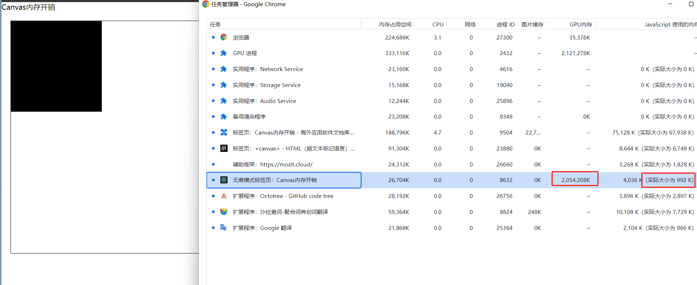

系统内存开销，基本上也是 2G

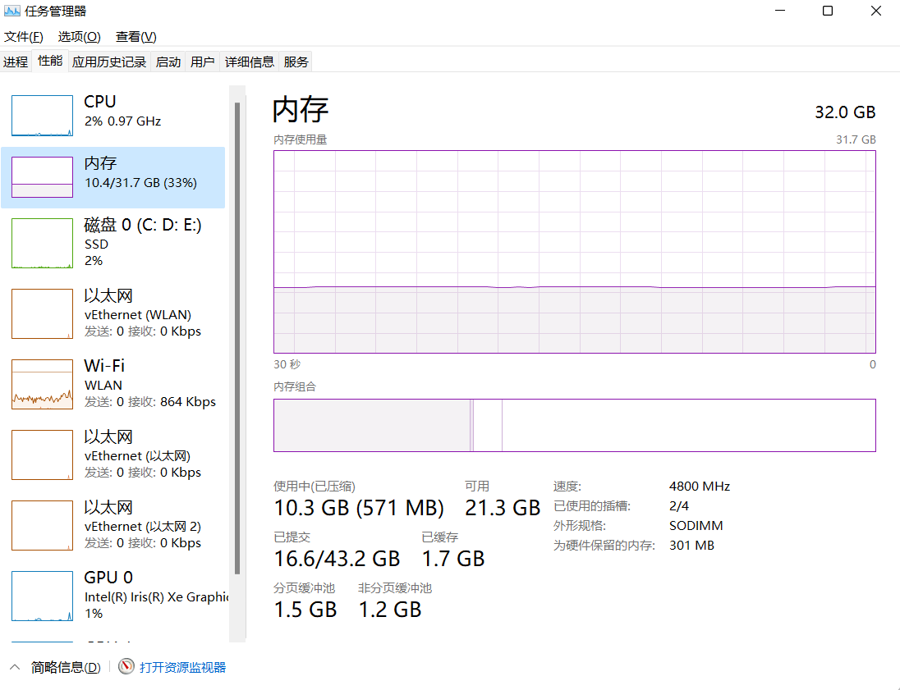

### 4.最大 GPU 内存限制

前面我们说过不同设备不同浏览器内核，对于 Canvas 是有最大的 GPU 内存限制的。在 Chrome 中，最大的限制就是系统剩余的内存空间。如果超出这个空间，浏览器会崩溃。以我电脑为例，最大内存为 32GB，剩余可用大概在 23G

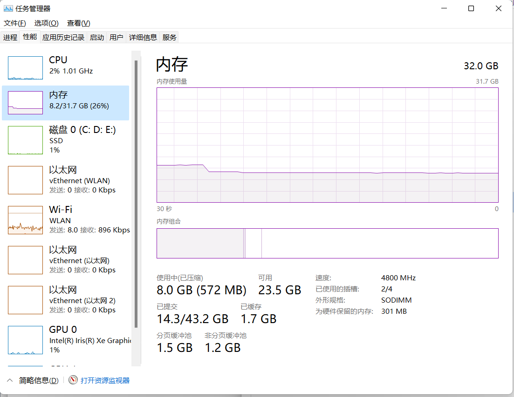

也就是说，按照 2000 个 canvas 消耗 2G 的 GPU 内存来说，这里我还可以添加 12 \* 2000 个元素。因此，我们可以点击 12 次按钮，看看内存开销情况，以及超过这个限制，浏览器会有什么反应。

可以看出，经过 12 次点击按钮，内存已经逼近极限
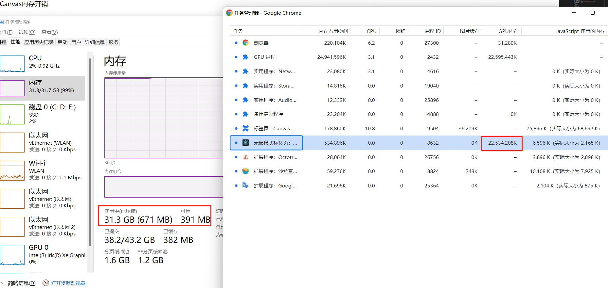

再多点击几次，进程直接崩溃黑屏
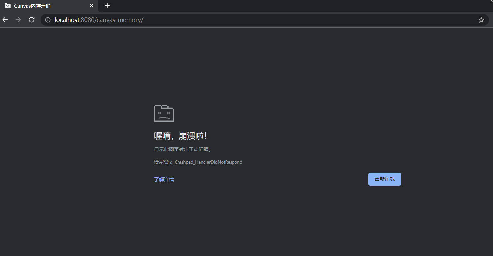

## 小结

为什么我们需要了解这个最大限制？实际上，我们在优化 canvas 时，最常用的一个手段是使用离屏 canvas 缓存每个元素的绘制，当元素量大时，我们需要创建大量的离屏 canvas。由于 GPU 内存有限制，因此我们在采取这个优化手段时，需要额外注意。GPU 内存开销过大，除了有进程崩溃的风险，还会导致我们在绘制时卡顿。
