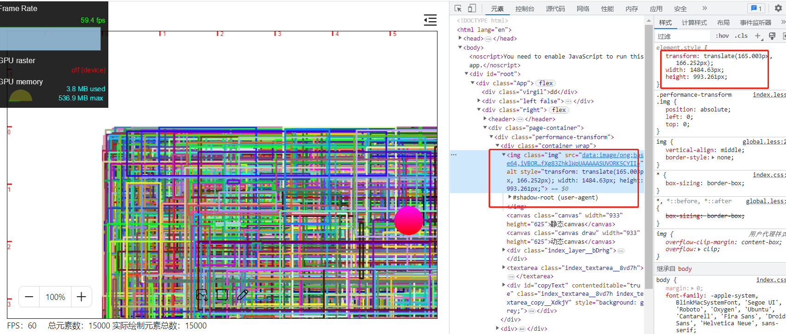
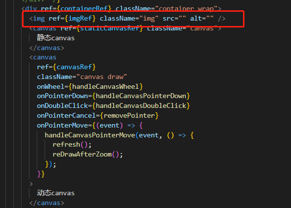
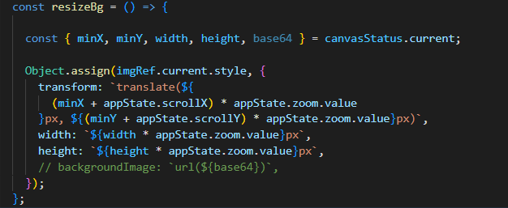
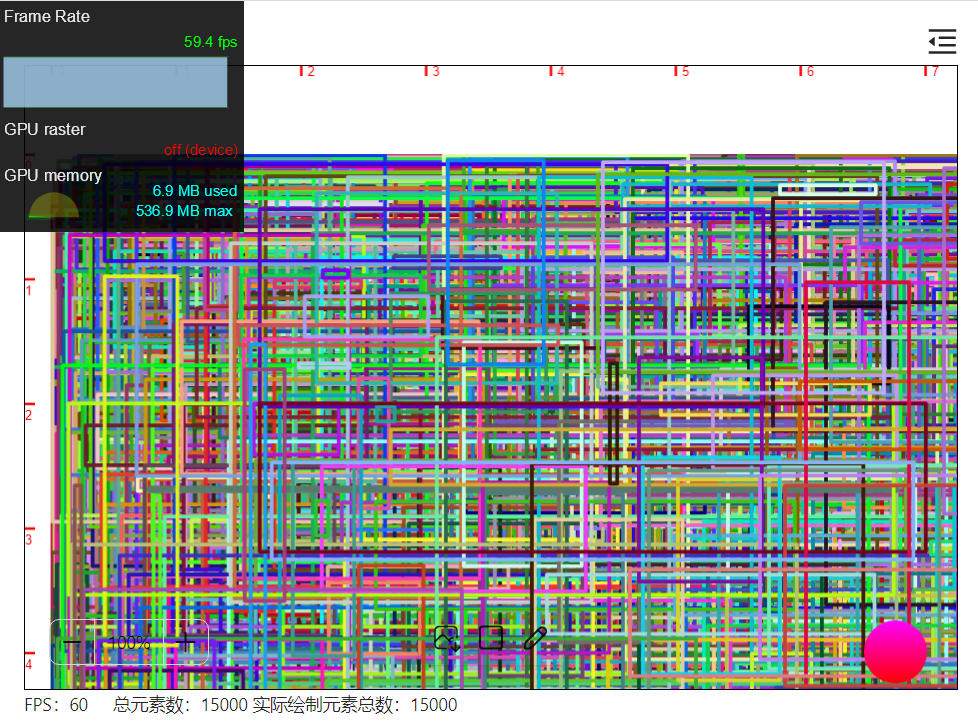

## 前言

上一节借助 css background 等属性，我们将平移缩放的性能提升到一个新的高度。但是，在平移缩放时，通过浏览器自带的帧率还是可以看得出，稍稍有点卡。这一节，我们不使用背景图片，而是使用 img 元素结合 css transform 将平移缩放性能再深度优化一波。

## 基本原理

和上一节的背景图片一致，只是这次我们生成的图片不是赋给容器背景，而是赋值给 img 元素。并通过 css transform 改变 img 元素的位移、大小等。从而达到平移缩放的目的。如下图所示

## 实现

定义一个 img 元素

只需要在上一节的操作基础上，修改一下 resizeBg 方法。这次，我们不是调节容器背景的 background 等属性，而是调节 img 元素的 transform 和宽度、高度等属性，达到平移缩放效果

## 效果

可以看到，平移缩放的过程中，左上角的帧率就保持得非常稳定。

## 小结

不论是基于容器背景图片还是基于 img 元素的操作，都能够给平移缩放性能带来很大的提升。但这两个方案也不是银弹，目前存在以下问题：

1.生成的图片不能过大，比较合适的大小在 5M 及以内。如果生成的图片质量过大，transform 等纯 css 操作也会很卡顿

2.放大时元素会模糊。由于第 1 点的限制，我们在生成图片时，选择生成 1 倍图。对于缩小操作来说，缩小后元素清晰度不受影响。但是放大到 30 倍时，元素显示就很模糊

3.全量绘制还是会卡顿。由于我们需要在编辑操作完成后全量绘制元素并生成图片，全量绘制操作本身就是耗时的操作，因此在生成图片时还是有一些卡顿。

当然，对于第 2 点，我们可以在放大时，重新绘制元素。

对于第 3 点，我们可以借助 offscreenCanvas+web worker 将全量绘制的操作放在 worker 线程操作

后面几节我们将实践上面两种方案
