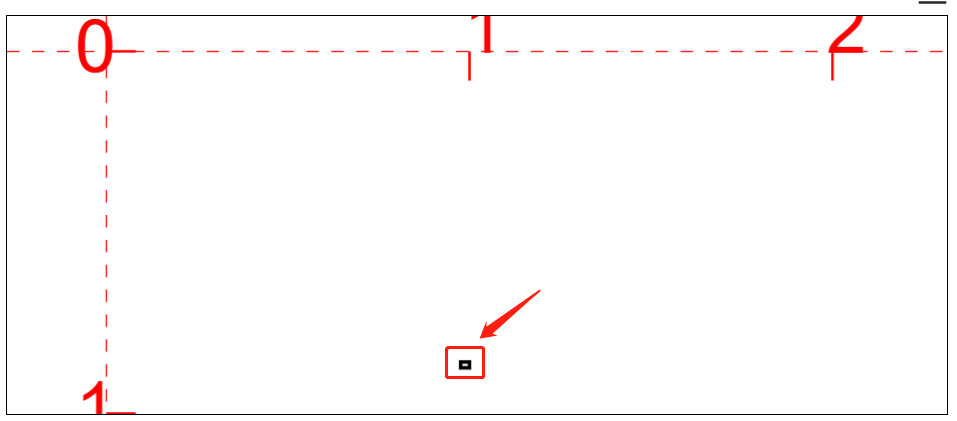
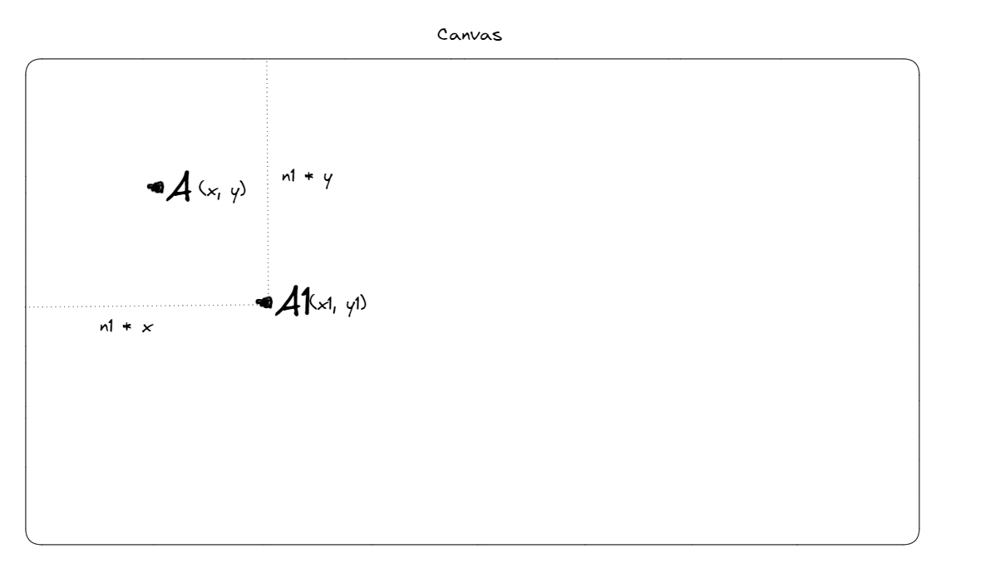
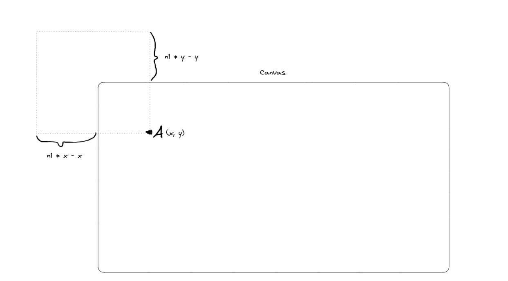
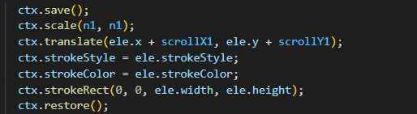
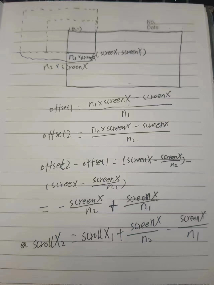
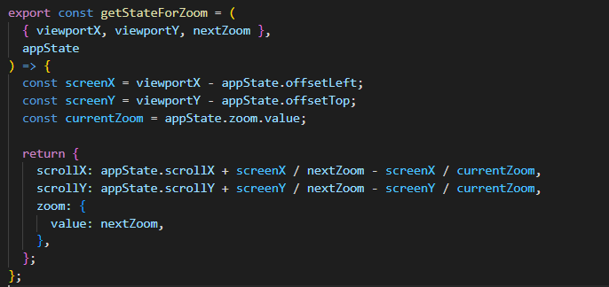
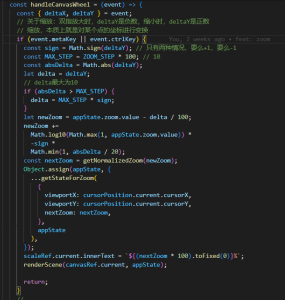

## 前言

所谓定点缩放，就是我们在缩放过程中，鼠标所指向的点还是不变。比如下图，当鼠标指向黑点时，此时画布缩放，这个点位置还是不变。

简单来说，定点缩放就是以鼠标当前位置为中心进行缩放。

## 基本原理

我们使用 zoom 记录当前画布的缩放比例，初始值为 1。同时还需要记录当前画布的滚动距离 scrollX，scrollY，默认都是 0 。

对于画布上的任意一点 A（x, y）。以 A 点为中心，放大 n1 倍后，移动到 A1(x1, y1)，其中：

x1 = n1 \* x

y1 = n1 \* y

由于我们是以 A 点为中心进行放大，因此放大后，我们还需要将 A1 平移到 A 点，偏移量为：

offsetX1 = n1 \* x - x

offsetY1 = n1 \* y - y

因此我们需要计算缩放前的偏移量。

scrollX1 = scrollX - offsetX1 / n1 = n1 - (x / n1)

scrollY1 = scrollY - offsetY1 / n1 = n1 - (y / n1)

我们可以将这个原理以数学公式来表达：在当前画布偏移量为 scrollX1，放大比例为 n1 的条件下，如果我们对画布上的任意一点 A(screenX, screenY)，以 A 为中心再放大 n2 倍，此时的偏移量 scrollX2 为：

scrollX2 = scrollX1 + (screenX / n2) - (screenX / n1)

具体演算可以看下面的草图：

## 具体实现

首先将上面的公式代码化，计算偏移量：

然后监听 canvas 的 wheel 事件，wheel 事件记录了缩放的距离

