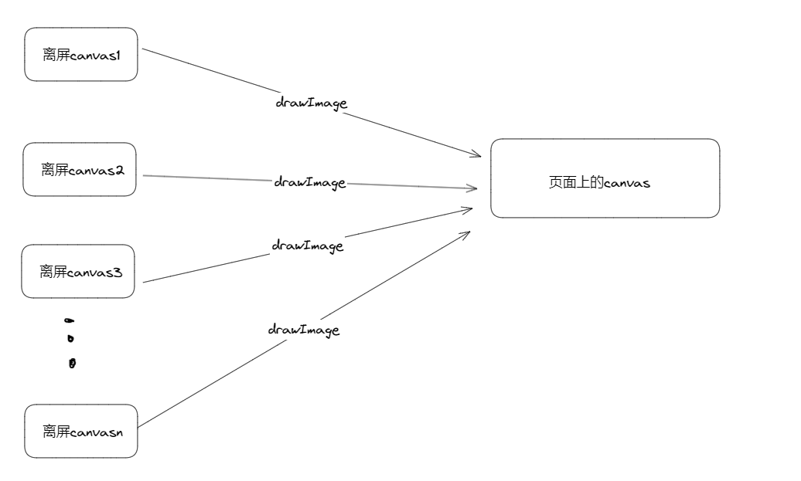
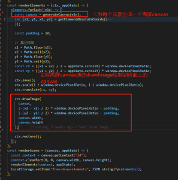
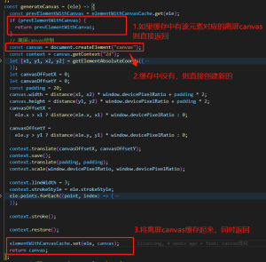
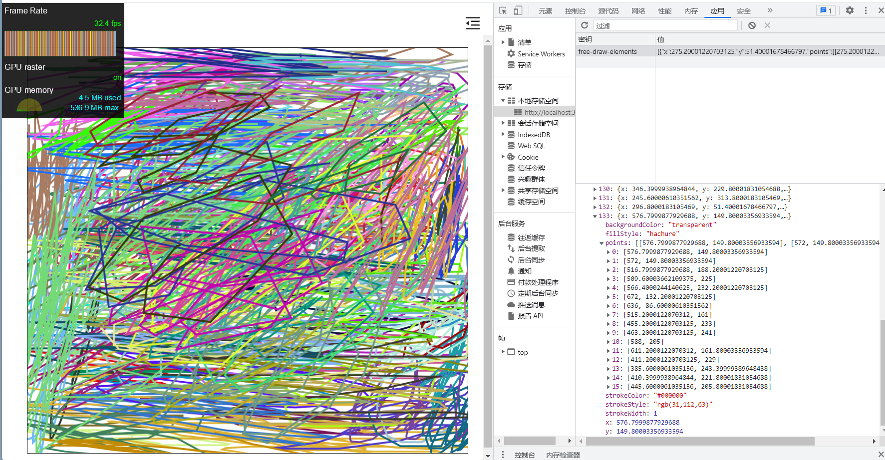
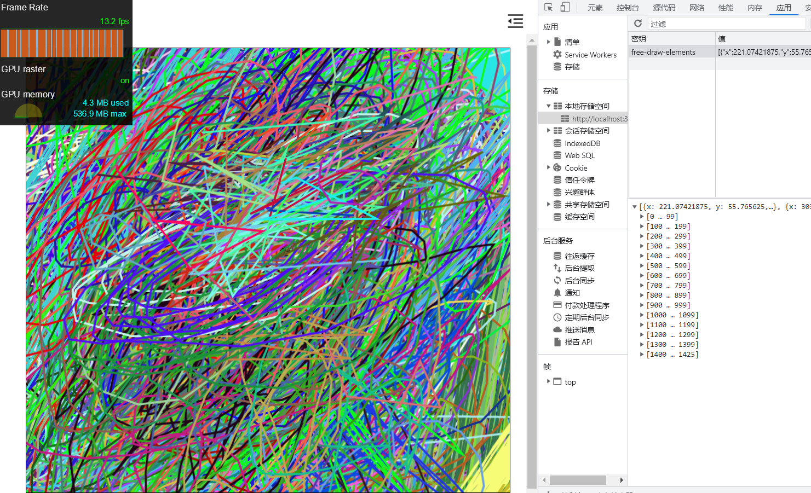
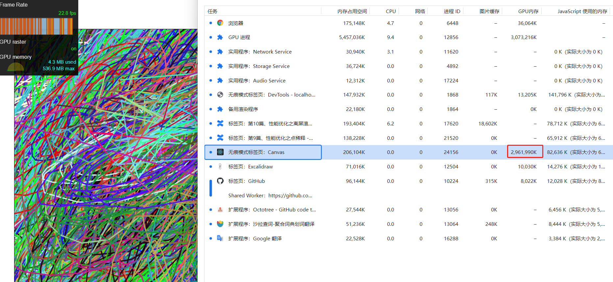

## 前言

在前面我们使用点稀释的手段，稍稍提高了下性能。有所提高但不多。才绘制 103 个元素，帧率就已经掉到了 30fps，显然还不能满足我们的应用。这一节，我们使用离屏渲染+缓存机制继续优化。

## 基本原理

如果仔细看上一节的实现，可以发现，每次 pointer move 触发 canvas 重绘事件，我们都从头开始遍历 elements，并调用 canvas 的 api 重新绘制元素。这就存在一个问题，当元素量大，比如几千个元素时，如果我只修改其中的一个元素，理论上我只需要重绘这个元素即可，其他元素不需要重绘。canvas 并没有提供这种缓存机制给我们。

在绘制每个元素时，都为这个元素创建一个离屏的 canvas 并缓存在全局变量 elementWithCanvasCache 中。如果元素的属性，比如大小、颜色发生改变，则将元素对应的离屏 canvas 从 elementWithCanvasCache 中删除，并重新创建新的离屏 canvas。如果元素属性没发生改变，则在下一次绘制时，调用 canvas 的 drawImage 直接绘制即可。

## 具体实现

遍历每个元素，为每个元素生成一个离屏的 canvas，然后调用 drawImage 将这个离屏 canvas 绘制到页面的 canvas 上。

重点逻辑在 generateCanvas 函数中

## 效果

优化前，绘制 133 个元素，帧率掉到 30fps

优化后，绘制 1500 个元素后，帧率才掉到 10fps，性能提升明显。

## 小结

离屏 canvas 是一种比较常用的优化手段，可以看出能给我们带来很大的性能提升。但是，别忘了，这种方式一大弊端是，GPU 内存开销很大。这属于一种用空间换速度的优化方案。在上例中，如果查看 Chrome 任务管理器可以发现，1500 个元素，GPU 开销差不多 3 个 G

