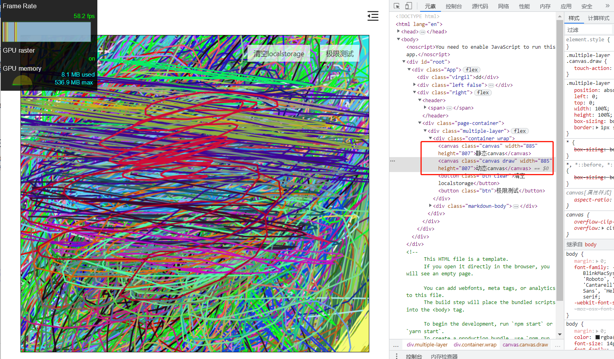
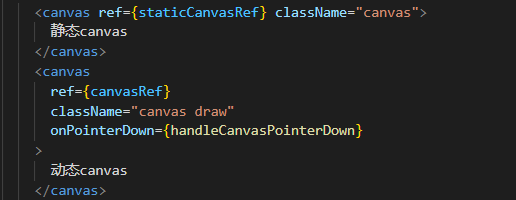
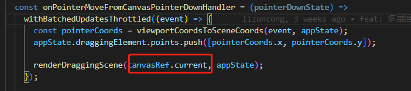
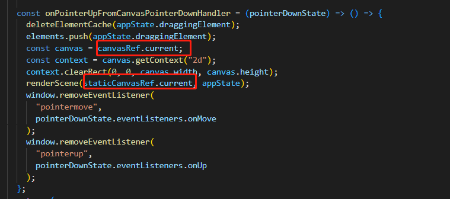
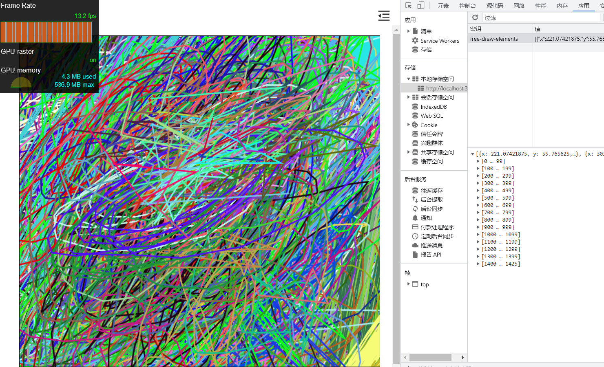
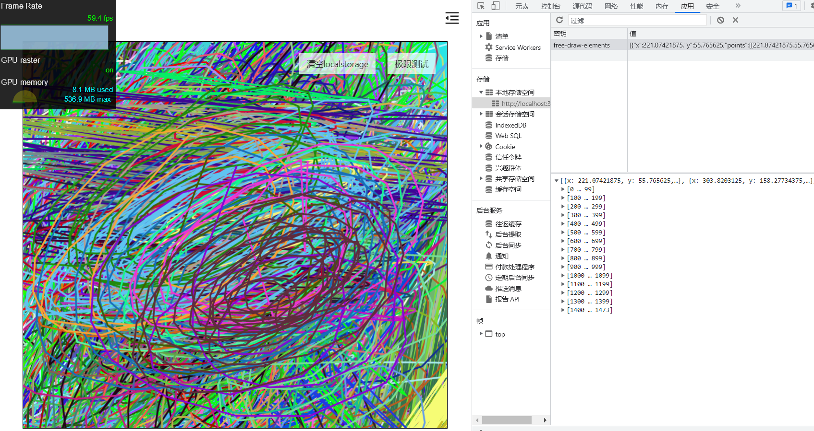
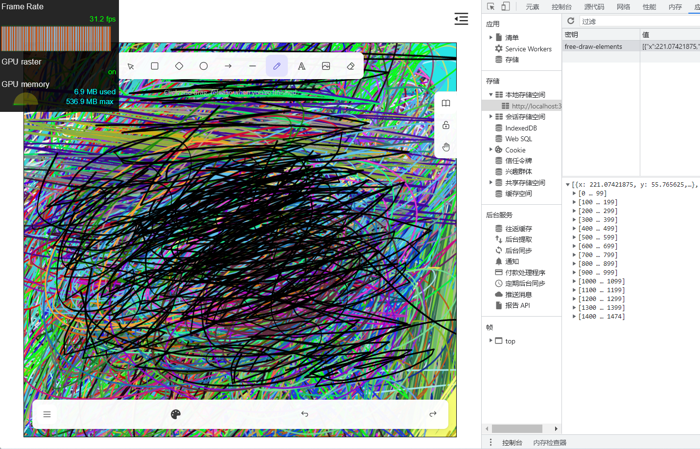

## 前言

在上一节，使用离屏 canvas+缓存，性能带来较大提升，目前绘制的元素数量达到 1000 才会出现卡顿。但我们的目标不止于此。这次，我们使用动态分层，将性能提升到一个新的阶段

## 基本原理

多层画布，就是使用两层画布，当然你也可以使用更多层。这里我使用两层画布，一层动态，一层静态。动态那层负责绘制正在编辑、绘制中的元素。静态那层画布负责绘制所有的元素。在动态画布绘制完元素，用户停止操作后，比如鼠标离开了画布，此时将元素绘制到静态那层画布，然后清空动态那层画布。

## 实现

首先定义两层 canvas，事件绑定在动态那层 canvas。在动态的 canvas 上监听 pointer down 事件

在 pointer move 事件中，绘制动态的 canvas。

用户操作完成，触发 pointer up 事件，在 pointer up 事件中，清空动态的 canvas，将元素重新绘制到静态的 canvas

## 效果

优化前，绘制到 1500 个元素时，基本卡成翔。

优化后，同样绘制 1500 个元素，帧率还能保持在 60fps，一帧不掉。实际上，优化至此，不论绘制多少元素，理论上已经基本不会掉帧。到这里，瓶颈已经在 GPU 内存开销，以及全量绘制静态 canvas 时的开销

我们再来看开源的 excalidraw，绘制同样数量的元素，开源的 excalidraw 已经掉帧很严重。至此，我们所采取的优化手段也已经超过开源的 excalidraw

## 小结

目前，我们采用点稀释、离屏 canvas+缓存、分层 canvas 等手段所带来的性能提升非常明显，已经超过开源的 excalidraw。但是，我们还没针对平移缩放进行优化。接下来的几节，我们将探索用于平移缩放的性能优化手段
