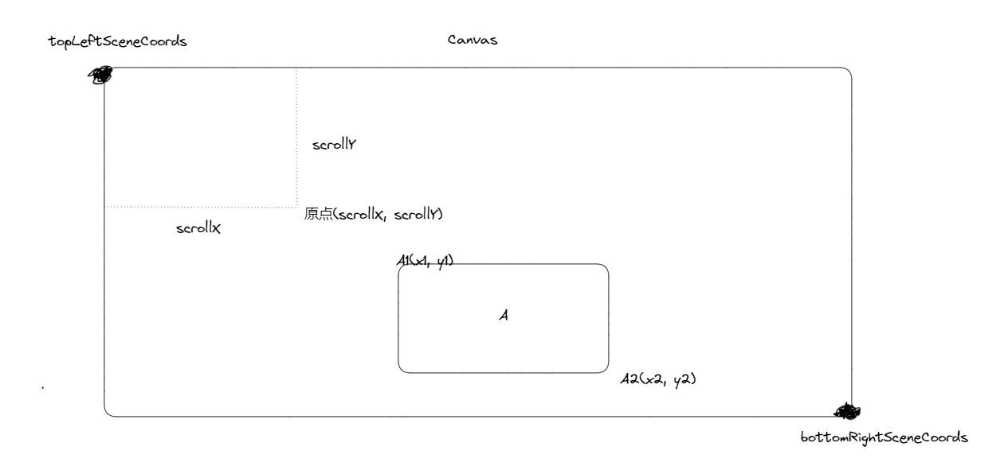
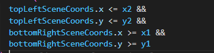
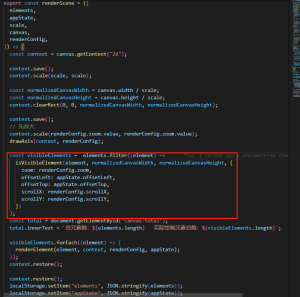
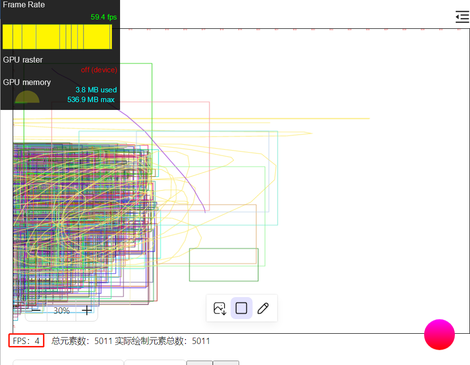
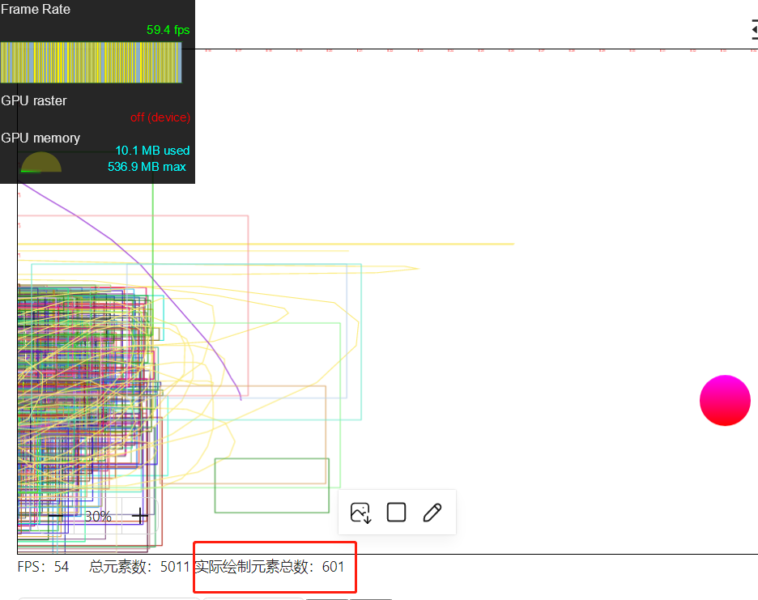

## 前言

目前我们还没针对画布平移缩放进行性能优化。实际上，平移缩放才是 canvas 性能的一大瓶颈，也是比较难优化的一部分。在前面我们所做的一些优化都是针对正在编辑、正在绘制的元素的，以提高元素编辑的体验。而平移缩放是在没有编辑元素的情况下进行的，是对整个画布进行操作，这其中需要频繁触发 canvas 全量重绘。这一节，我们先进行一个简单的优化，即只绘制可视区域内的元素

## 基本原理

在触发 canvas 重绘时，遍历每一个元素，然后判断该元素是否在可视区域内。如果在，则将元素绘制到 canvas 中。否则不绘制。从而缩短 canvas 绘制的时间。判断元素是否在可视区域内的算法原理如下：

对于画布任何一个元素。我们只需要获取该元素的包围矩形的左上角的坐标 A1(x1, y1)，以及右下角的坐标 A2(x2, y2)，

同时获取画布左上角的坐标 topLeftSceneCoord，以及画布右下角的坐标 bottomRightSceneCoords。只要 A2 比 topLeftSceneCoord 大，同时 A1 比 bottomRightSceneCoord 小，就说明元素在可视区域内，即如下判断：

## 实现

遍历每个元素并调用 isVisibleElement 判断元素是否在可视区域内。

这里的逻辑主要在 isVisible 函数中，这个函数获取元素最左边、最右边、最上和最下的坐标，和当前视口坐标进行判断

## 效果

优化前，即使部分元素已经滚出可视区域内，但 canvas 还是绘制。导致在平移缩放过程中，主线程非常卡顿，左下角的 FPS 就是用 raf 在主线程绘制的

优化后，只绘制可视区域内的元素，相对来说性能提升一些。

## 小结

只绘制可视区域，在放大的时候比较有用，性能提升比较明显。如果缩小，在画布上就需要绘制所有元素，此时平移就会很卡。因为需要重绘所有元素
