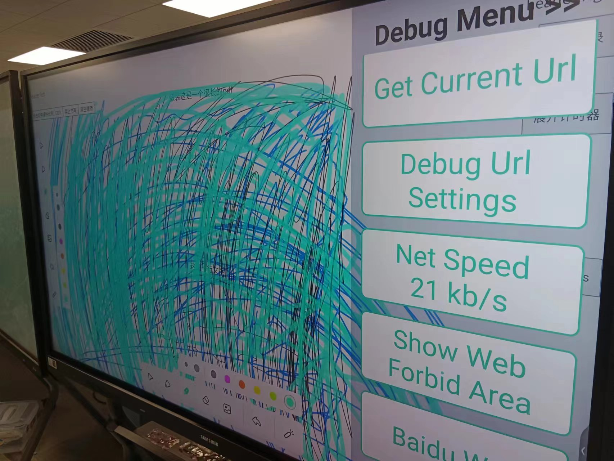
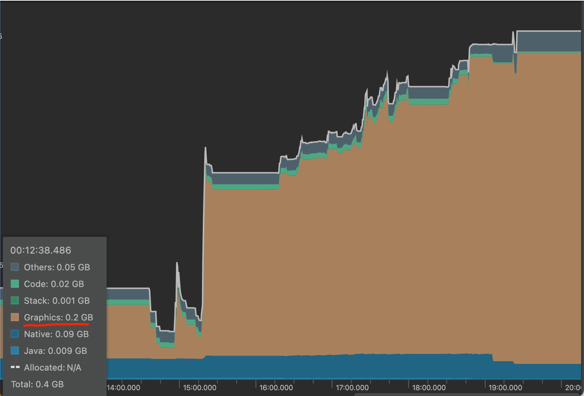
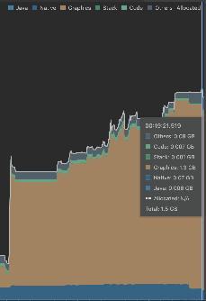
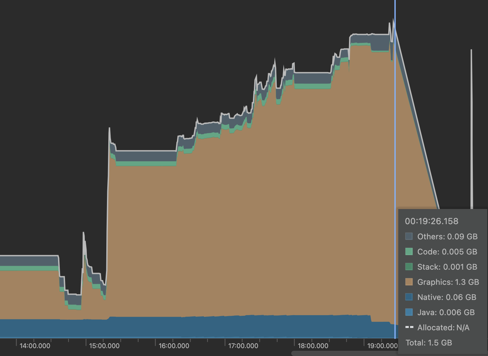
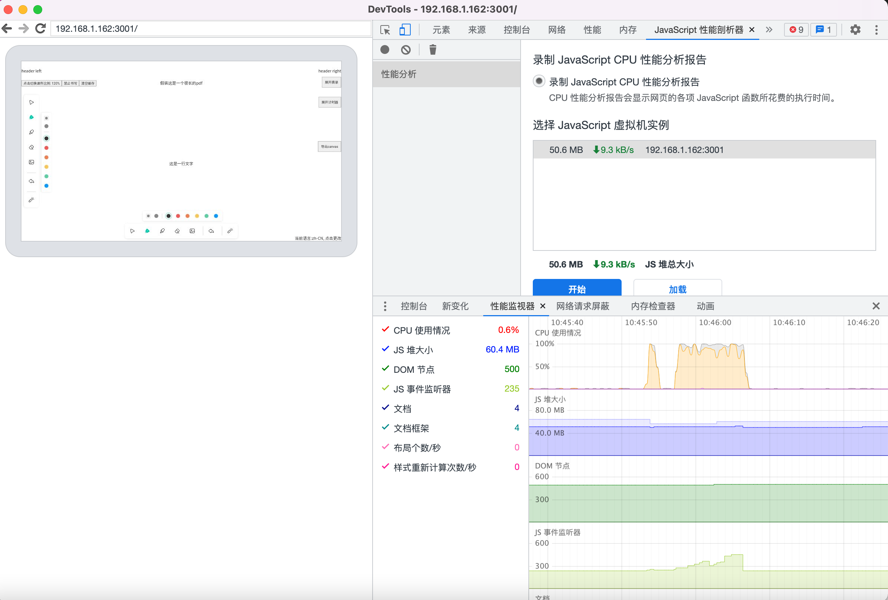
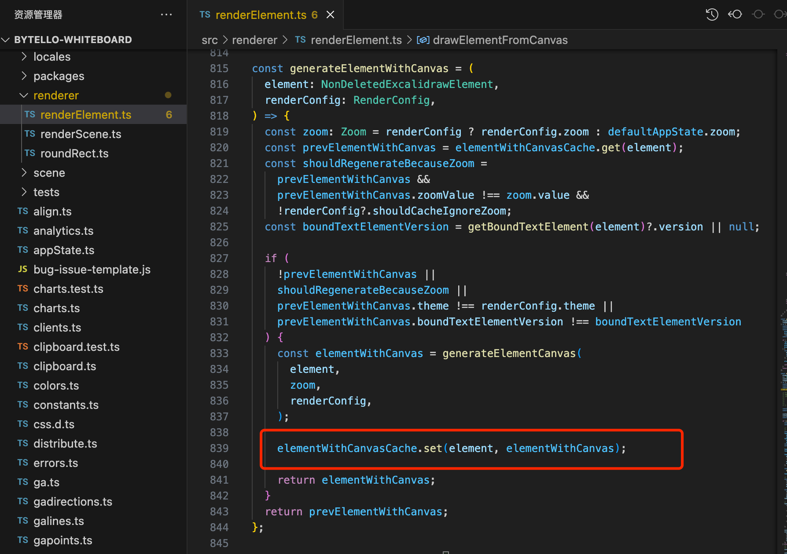

## 问题简述

在大板安卓操作系统，当书写笔迹增加时，会导致安卓内存溢出从而被操作系统杀死，安卓应用闪退。安卓端同事初步排查当内存达到1.4G时，应用就会崩溃闪退。

## 问题排查

在书写的过程中，通过Android Studio的 profier抓取应用内存，可以发现随着书写笔迹越来越多，内存也随着增加，同时并没有被释放。

下图左边是应用初始化时的内存开销情况，其中黄色区域表示的是Graphics(绘图层)内存开销，这就是GPU内存开销。可以看到，初始化时，GPU内存仅0.2GB。后半部分是书写过程中，内存的增长情况

随着书写笔迹增多，GPU内存增加到了1.3GB，而且没有被回收

当安卓应用达到1.4GB时，应用闪退退出，内存随之下降

通过adb调出安卓webview页面控制台，观察web页面的内存开销情况，可以发现js堆内存比较平稳，不存在内存泄漏的情况

结合以上分析，可以得出初步结论：

- 1.随着笔迹增多，js堆内存波动不大，不存在内存泄漏的情况

- 2.随着笔迹增多，GPU 内存暴增，有可能会存在内存泄漏的情况。

因此，最有可能就是GPU内存暴增导致安卓应用占用内存过高，而大板安卓系统只有4G的内存，操作系统检测到安卓应用内存占用过高杀死安卓进程，导致应用崩溃。

到这里，就需要从GPU内存入手了。我们知道在浏览器中，GPU主要负责处理与图形相关的任务和操作：

- 1. 图形渲染：负责将网页中的图形、图片、视频等元素进行渲染，转换为屏幕上的可见图像。

- 2. 动画和过渡效果：处理复杂的动画和过渡效果。通过利用GPU的硬件加速能力，可以提供更流畅的动画效果，减少CPU的负担。

- 3. 视频解码和播放：GPU可以协助CPU进行视频解码和播放任务。能够加速视频解码过程，提供更高效的视频播放性能，减少对CPU的压力。

- 4. WebGL：负责执行WebGL渲染

- 5. 图形效果和滤镜：执行各种图形效果和滤镜，如模糊、阴影、色彩调整等。通过利用GPU的并行处理能力，可以快速应用这些效果，提高图形处理的效率。

在我们的白板中，利用到GPU的无非就是canvas了。基于之前的调研结论[Canvas内存开销](https://lizuncong.github.io/excalidraw-app/#/doc/memory)，理论情况下，面积为1px的canvas大概需要4字节的GPU内存，因此512px * 512px的canvas大概需要1M的GPU内存。

同时，在我们的白板中，为了实现前端的绘制加速，详情看这里，[性能优化之离屏渲染及缓存](https://lizuncong.github.io/excalidraw-app/#/doc/offscreen)，我们采用了离屏渲染+缓存的方案实现前端canvas的绘制加速。这里就会有一个问题，一个笔迹我们使用一个离屏canvas缓存，100个笔迹就意味着有100个离屏canvas被我们缓存下来了。这些canvas都需要消耗GPU内存。随着笔迹增多，离屏canvas数量增多，对应的GPU内存也增多。这就是为啥我们的GPU内存居高不下的原因。

## 为什么PC端或者window端就不会出现闪退的问题

实际上，由于pc端或者window端，操作系统的内存一般都比较大，比如16GB或者32GB。除非是极端场景下书写了大量的笔迹，否则GPU内存不太容易达到被操作系统杀死的阀值。而安卓端操作系统由于内存仅4GB。如果一个应用内存占到1.4GB，就容易被操作系统杀死。

## 白板潜在的可能导致内存泄漏的点

- 1.切页时没有清空elementWithCanvasCache

- 2.结束上课时没有清空elementWithCanvasCache

- 3.元素发生变化，没有删除对应的离屏canvas

- 4.教师端IFP断开连接回到连接码页面，没有清空缓存

- 5.同时需要注意，由于白板允许用户插入自定义图片，而图片也占用GPU内存开销，因此有必要限制插入的图片大小。

## 该怎么优化？

需要针对安卓端修改缓存方案。既要兼顾内存开销，又要兼顾前端绘制性能。

### 方案一

每5或者10个(需要实验验证多少个比较合适)笔迹用一个离屏canvas缓存，减小离屏canvas的数量从而减少GPU 内存开销，同时也能兼顾前端的绘制性能。操作稍麻烦，如果对某个元素修改，则需要重绘这个元素所在的离屏canvas。

### 方案二

前端动态限制离屏canvas的数量，比如通过计算当前已经缓存的离屏canvas数量，通过理论计算对应的GPU内存开销，当然这只是理论值，如果当前离屏canvas占用的GPU内存达到了600MB，则不再缓存后面的笔迹。

这种方法操作简单，但是如果后面绘制的笔迹增加的情况下，前端绘制性能很容易跟不上。

### 方案三

再想想。。。。

