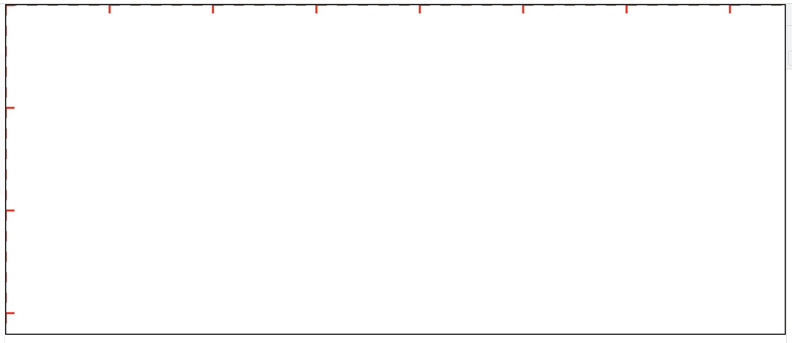
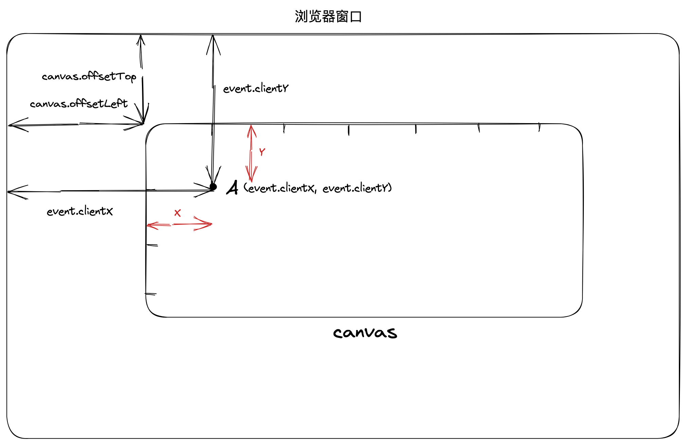
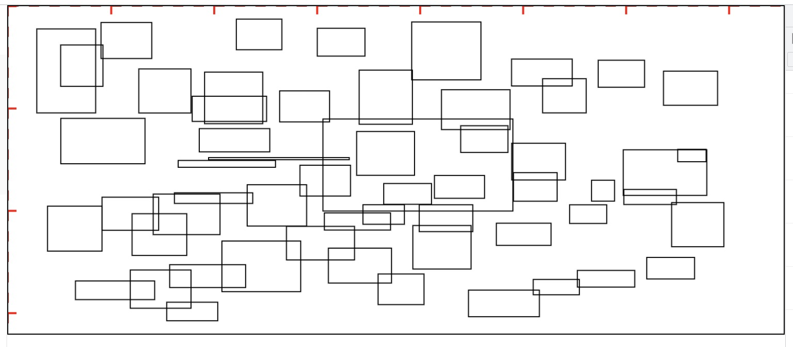
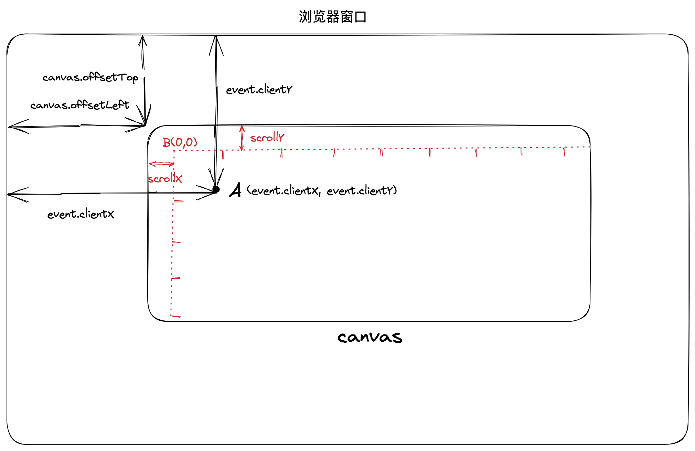
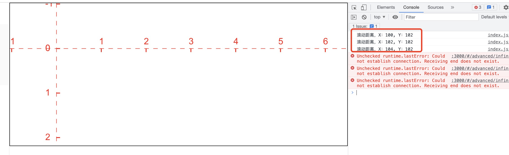
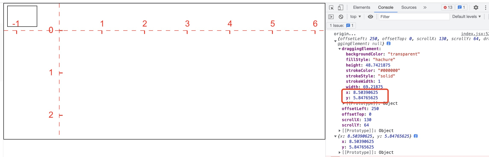

## 前言

本节我们通过简单的矩形绘制学习如何实现无限画布

## 准备工作

在绘制前，我们需要矫正 canvas 的分辨率，使用 appState 保存 canvas 相关的信息。新建一个 index.jsx 文件，初始化代码如下：

```jsx
const appState = {
  offsetLeft: 0,
  offsetTop: 0,
};
const Canvas = memo(() => {
  const canvasRef = useRef(null);
  const canvasContainer = useRef(null);
  useEffect(() => {
    const canvas = canvasRef.current;
    const context = canvas.getContext("2d");
    const { offsetWidth, offsetHeight, offsetLeft, offsetTop } = canvas;
    canvas.width = offsetWidth * window.devicePixelRatio;
    canvas.height = offsetHeight * window.devicePixelRatio;
    context.scale(window.devicePixelRatio, window.devicePixelRatio);

    appState.offsetLeft = offsetLeft;
    appState.offsetTop = offsetTop;
  }, []);

  return (
    <div ref={canvasContainer}>
      <canvas ref={canvasRef} className="canvas">
        绘制canvas
      </canvas>
    </div>
  );
});
```

## 绘制坐标轴

为方便观察，首先在 canvas 上绘制一个坐标轴。新建一个 renderScene.js 文件，实现 drawAxis 方法：

```js
const drawAxis = (ctx) => {
  ctx.save();
  const rectH = 100; // 纵轴刻度间距
  const rectW = 100; // 横轴刻度间距
  const tickLength = 8; // 刻度线长度
  const canvas = ctx.canvas;
  ctx.translate(0, 0);
  ctx.strokeStyle = "red";
  ctx.fillStyle = "red";
  // 绘制横轴和纵轴
  ctx.save();
  ctx.beginPath();
  ctx.setLineDash([10, 10]);
  ctx.moveTo(0, 0);
  ctx.lineTo(0, canvas.height);
  ctx.moveTo(0, 0);
  ctx.lineTo(canvas.width, 0);
  ctx.stroke();
  ctx.restore();
  // 绘制横轴和纵轴刻度
  ctx.beginPath();
  ctx.lineWidth = 2;
  ctx.textBaseline = "middle";

  for (let i = 0; i < canvas.height / rectH; i++) {
    // 绘制纵轴刻度
    ctx.moveTo(0, i * rectH);
    ctx.lineTo(tickLength, i * rectH);
    ctx.font = "20px Arial";
    ctx.fillText(i, -25, i * rectH);
  }
  for (let i = 1; i < canvas.width / rectW; i++) {
    // 绘制横轴刻度
    ctx.moveTo(i * rectW, 0);
    ctx.lineTo(i * rectW, tickLength);
    ctx.font = "20px Arial";
    ctx.fillText(i, i * rectW - 5, -15);
  }
  ctx.stroke();

  ctx.restore();
};

const renderScene = (canvas) => {
  const context = canvas.getContext("2d");
  drawAxis(context);
};

export default renderScene;
```

然后在 index.jsx 中引入 renderScene

```jsx
useEffect(() => {
  //...
  renderScene(canvas);
}, []);
```

效果如下：



## 绘制矩形

### 屏幕坐标系转 canvas 坐标系

在开始绘制矩形之前，我们先来看下屏幕坐标系如何转换成 canvas 坐标系。如下图所示，对于 canvas 上的任意一点，比如下面的 A 点。当我们点击事件位于 A 点时，我们可以获取到 A 点的屏幕坐标 `(event.clientX, event.clientY)`。那么 A 点的 canvas 坐标计算方式就是

```js
x = event.clientX - canvas.offsetLeft;
y = event.clientY - canvas.offsetTop;
```



因此我们可以封装一个坐标系转换的工具方法`viewportCoordsToSceneCoords`

```js
const viewportCoordsToSceneCoords = (
  { clientX, clientY },
  { offsetLeft, offsetTop }
) => {
  const x = clientX - offsetLeft;
  const y = clientY - offsetTop;
  return { x, y };
};
```

### 绘制矩形

- 声明一个 elements 数组存放我们绘制的图形
- 为 canvas 绑定一个`onPointerDown={handleCanvasPointerDown}`事件

```js
const handleCanvasPointerDown = (event) => {
  const origin = viewportCoordsToSceneCoords(event, appState);
  const pointerDownState = {
    origin,
    lastCoords: { ...origin },
    eventListeners: {
      onMove: null,
      onUp: null,
    },
  };
  const element = {
    x: pointerDownState.origin.x,
    y: pointerDownState.origin.y,
    width: 0,
    height: 0,
    strokeColor: "#000000",
    backgroundColor: "transparent",
    fillStyle: "hachure",
    strokeWidth: 1,
    strokeStyle: "solid",
  };
  appState.draggingElement = element;
  elements.push(element);
  const onPointerMove =
    onPointerMoveFromCanvasPointerDownHandler(pointerDownState);
  const onPointerUp = onPointerUpFromCanvasPointerDownHandler(pointerDownState);
  window.addEventListener("pointermove", onPointerMove);
  window.addEventListener("pointerup", onPointerUp);
  pointerDownState.eventListeners.onMove = onPointerMove;
  pointerDownState.eventListeners.onUp = onPointerUp;
};
```

`handleCanvasPointerDown`事件主要做了以下几件事：

- 调用`viewportCoordsToSceneCoords`方法将点击事件的屏幕坐标转换成 canvas 左标，并保存在 origin 中，这个也是我们绘制矩形的起点(即矩形的左上角的点)
- 初始化一个 element 对象，这个 element 对象保存绘制矩形所需要的坐标信息以及颜色信息等
- 将 element 对象添加到 elements 数组中，并保存在 appState.draggingElement 中，方便后续使用
- 在 window 上注册`pointermove`和`pointerup`事件，其中`pointermove`事件用于计算鼠标移动的距离，计算矩形的宽度和高度。`pointerup`用于注销这两个事件，因为一旦鼠标离开，就说明绘制过程结束。

`onPointerUpFromCanvasPointerDownHandler`实现如下：

```js
const onPointerUpFromCanvasPointerDownHandler =
  (pointerDownState) => (event) => {
    window.removeEventListener(
      "pointermove",
      pointerDownState.eventListeners.onMove
    );
    window.removeEventListener(
      "pointerup",
      pointerDownState.eventListeners.onUp
    );
  };
```

`onPointerMoveFromCanvasPointerDownHandler`事件逻辑如下：

- 根据鼠标移动事件，计算当前点的 canvas 坐标
- 计算矩形的宽高
- 调用 renderScene 开始绘制

```js
const onPointerMoveFromCanvasPointerDownHandler =
  (pointerDownState) => (event) => {
    const pointerCoords = viewportCoordsToSceneCoords(event, appState);
    pointerDownState.lastCoords.x = pointerCoords.x;
    pointerDownState.lastCoords.y = pointerCoords.y;
    appState.draggingElement.width =
      pointerCoords.x - pointerDownState.origin.x;
    appState.draggingElement.height =
      pointerCoords.y - pointerDownState.origin.y;
    renderScene(canvasRef.current);
  };
```

`renderScene`新增 `renderElements` 方法

```js
const renderElements = (ctx) => {
  elements.forEach((ele) => {
    ctx.save();
    ctx.translate(ele.x, ele.y);
    ctx.strokeStyle = ele.strokeStyle;
    ctx.strokeColor = ele.strokeColor;
    ctx.strokeRect(0, 0, ele.width, ele.height);
    ctx.restore();
  });
};
const renderScene = (canvas) => {
  const context = canvas.getContext("2d");
  context.clearRect(0, 0, canvas.width, canvas.height);
  drawAxis(context);
  renderElements(context);
};
```

最终效果如下：



现在，我们已经可以在画布上随意绘制矩形了。

## 无限画布

所谓无限画布，就是我们可以水平或者竖直方向滚动画布，并可以实现绘制。如下图，假设我们在 canvas 水平方向滚动了 scrollX，在竖直方向滚动了 scrollY 距离，那么我们原先的坐标系原点就从`(0,0)`的位置移动到了下图中的`B`点。对于滚动后的画布上面的任意一点，比如 A 点，A 点的坐标就变成了

```js
x = event.clientX - canvas.offsetLeft - scrollX;
y = event.clientY - canvas.offsetTop - scrollY;
```



我们需要给 canvas 添加滚动事件`onWheel={handleCanvasWheel}`，同时记录滚动距离。并重新绘制

```js
const handleCanvasWheel = (event) => {
  const { deltaX, deltaY } = event;
  appState.scrollX = appState.scrollX - deltaX;
  appState.scrollY = appState.scrollY - deltaY;
  renderScene(canvasRef.current, appState);
};
```

我们将滚动距离保存在`appState`中，并传入`renderScene`方法：

```js
const renderScene = (canvas, appState) => {
  const context = canvas.getContext("2d");
  context.clearRect(0, 0, canvas.width, canvas.height);
  drawAxis(context, appState);
  renderElements(context, appState);
};
```

由于坐标发生了改变，因此我们需要调整下 drawAxis 的逻辑。这里我绘制出了横轴和纵轴的正负刻度。

```js
const drawAxis = (ctx, { scrollX, scrollY }) => {
  ctx.save();
  const rectH = 100; // 纵轴刻度间距
  const rectW = 100; // 横轴刻度间距
  const tickLength = 8; // 刻度线长度
  const canvas = ctx.canvas;
  ctx.translate(scrollX, scrollY);
  ctx.strokeStyle = "red";
  ctx.fillStyle = "red";
  // 绘制横轴和纵轴
  ctx.save();
  ctx.beginPath();
  ctx.setLineDash([10, 10]);
  ctx.moveTo(0, -scrollY);
  ctx.lineTo(0, canvas.height - scrollY);
  ctx.moveTo(-scrollX, 0);
  ctx.lineTo(canvas.width - scrollX, 0);
  ctx.stroke();
  ctx.restore();
  // 绘制横轴和纵轴刻度
  ctx.beginPath();
  ctx.lineWidth = 2;
  ctx.textBaseline = "middle";
  for (let i = 0; i < scrollY / rectH; i++) {
    // 绘制纵轴负数刻度
    ctx.moveTo(0, -i * rectH);
    ctx.lineTo(tickLength, -i * rectH);
    ctx.font = "20px Arial";
    ctx.fillText(-i, -25, -i * rectH);
  }
  for (let i = 0; i < (canvas.height - scrollY) / rectH; i++) {
    // 绘制纵轴正数刻度
    ctx.moveTo(0, i * rectH);
    ctx.lineTo(tickLength, i * rectH);
    ctx.font = "20px Arial";
    ctx.fillText(i, -25, i * rectH);
  }
  for (let i = 1; i < scrollX / rectW; i++) {
    // 绘制横轴负数刻度
    ctx.moveTo(-i * rectW, 0);
    ctx.lineTo(-i * rectW, tickLength);
    ctx.font = "20px Arial";
    ctx.fillText(-i, -i * rectW - 10, -15);
  }
  for (let i = 1; i < (canvas.width - scrollX) / rectW; i++) {
    // 绘制横轴正数刻度
    ctx.moveTo(i * rectW, 0);
    ctx.lineTo(i * rectW, tickLength);
    ctx.font = "20px Arial";
    ctx.fillText(i, i * rectW - 5, -15);
  }
  ctx.stroke();

  ctx.restore();
};
```

坐标轴效果如下：



可以看出坐标轴的绘制和滚动距离完全对应的上。我们已经能够实现一个无限画布并且正确绘制坐标轴，但此时如果我们在上面绘制一个矩形就会发现，矩形的宽度和高度是正确的，但是矩形的原点（左上角的起点）即 x 和 y 并不对


